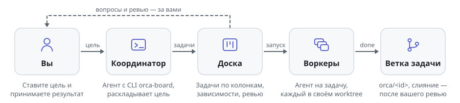
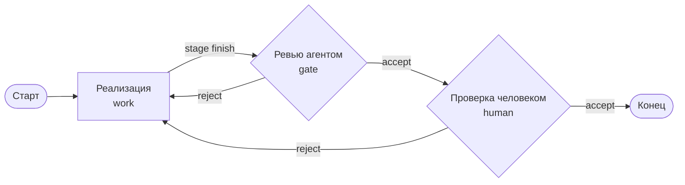

<h1 align="center">
  <picture>
    <source media="(prefers-color-scheme: dark)" srcset="docs/assets/logo-dark.svg">
    
  </picture>
</h1>

<p align="center">Оркестратор CLI-агентов с канбан-доской — по вашей подписке, без API-ключей.</p>

<p align="center">
  <a href="https://github.com/NANDIorg/BigOrcaCocks/releases"></a>
  <a href="https://github.com/NANDIorg/BigOrcaCocks/actions/workflows/ci.yml"></a>
  
</p>

<p align="center">
  <a href="#установка">Установка</a> · <a href="#как-это-работает">Как это работает</a> · <a href="#документация">Документация</a>
</p>

orca-board — десктоп-приложение, в котором задача на доске — это CLI-агент (Claude Code, Codex, OpenCode и другие)
в своём git worktree. Вы ставите цель, агент-координатор раскладывает её на подзадачи, воркеры делают их параллельно,
а ревью и решения остаются за вами.

- **Задача = агент в своём worktree.** Каждая подзадача — отдельная ветка и терминал, агенты не мешают друг другу.
- **По вашей подписке.** Приложение не знает про API-ключи: оно запускает CLI-агента в PTY, как обычный терминал.
- **Этапы — графом.** Ревью агентом, вопросы и приёмка человеком, мерж — узлы воркфлоу, который настраивается под тип задачи.

## Как это работает

<picture>
  <source media="(max-width: 600px) and (prefers-color-scheme: dark)" srcset="docs/assets/how-it-works-narrow-dark.svg">
  <source media="(max-width: 600px)" srcset="docs/assets/how-it-works-narrow.svg">
  <source media="(prefers-color-scheme: dark)" srcset="docs/assets/how-it-works-dark.svg">
  
</picture>

1. **Цель.** Вы создаёте глобальную задачу и нажимаете «Координатор» — открывается CLI-агент с инструкцией и целью.
2. **Декомпозиция.** Координатор через CLI `orca-board` заводит подзадачи на роли типа задачи (программист, QA, ревьюер…).
3. **Работа.** Каждый воркер стартует в своём worktree на ветке `orca/<taskId>`. Закончил — обязан вызвать
   `orca-board done --summary "..."`; выход процесса без этого — состояние `unknown`, а не «сделано».
4. **Этапы.** Ветку подзадачи приложение сливает в ветку глобальной задачи `feature/<runId>-<slug>`, дальше граф ведёт
   её по этапам: ревью агентом, решение ИИ, вопрос или приёмка человеком. Вопросы и запросы приходят в Инбокс.
5. **Готово.** Вы принимаете результат на «Проверке». Ветка остаётся локальной: push, PR и мерж в основную ветку — ваше
   решение (или ноды `git` / `merge` в графе типа).

Подробнее — [docs/nested-kanban.md](docs/nested-kanban.md) и [docs/workflow.md](docs/workflow.md).

## Установка

| ОС | Файл в [Releases](https://github.com/NANDIorg/BigOrcaCocks/releases) | Примечание |
|---|---|---|
| macOS, Apple Silicon | `orca-board-<версия>-arm64.dmg` | подписан Developer ID и нотаризован (с 1.0.1) |
| macOS, Intel | `orca-board-<версия>-x64.dmg` | то же |
| Windows x64 | `orca-board-<версия>-x64.exe` | установщик NSIS, можно выбрать папку; без подписи кода |
| Windows x64 | `orca-board-<версия>-portable-x64.exe` | запускается без установки; без подписи кода |

Linux-сборки нет. Быстрый старт:

1. Поставьте **git** и хотя бы один CLI-агент — нужен **`claude`** (Claude Code с подпиской): на нём по умолчанию
   работает координатор. Node не нужен: CLI `orca-board` внутри приложения работает на Node из Electron.
2. Добавьте git-репозиторий кнопкой «+» в сайдбаре.
3. Создайте глобальную задачу и нажмите «Координатор».

<details>
<summary>macOS: Gatekeeper и «приложение загружено из Интернета»</summary>

У подписанного и нотаризованного выпуска допустимо только обычное подтверждение «приложение загружено из Интернета»
с кнопкой «Открыть». Блокировка «разработчик не может быть проверен», «Apple не может проверить на вредоносное ПО» или
«повреждено» означает, что проверка доверия не пройдена: сообщите версию, архитектуру и текст ошибки в
[issues](https://github.com/NANDIorg/BigOrcaCocks/issues). Не отключайте Gatekeeper и не снимайте quarantine.

Исторический v1.0.0 подписан ad-hoc без нотаризации и блокируется Gatekeeper — ставьте 1.0.1 или новее. Статус
конкретной сборки — в release notes ([docs/releases/](docs/releases/)).
</details>

<details>
<summary>Windows: SmartScreen и что проверено</summary>

Сборка не подписана, поэтому при первом запуске SmartScreen покажет «Windows защитила ваш компьютер»: «Подробнее» →
«Выполнить в любом случае». Агенты, поставленные через `npm i -g`, находятся и в `%APPDATA%\npm`, даже если его нет
в PATH; CLI `orca-board` — это `orca-board.cmd`, который запускает Node из Electron.

Сборки Windows собирает CI на `windows-latest`, там же проходит `pnpm verify`, но на живой Windows приложение вручную
проверялось мало — о проблемах пишите в [issues](https://github.com/NANDIorg/BigOrcaCocks/issues).
Известные разборы — [docs/investigations/](docs/investigations/).
</details>

## Возможности

| | Возможность | Суть |
|---|---|---|
| 🗂 | **Двухуровневая доска** | Глобальные задачи, внутри — доска подзадач воркеров. Колонки проекта настраиваются в «О проекте»; колонка «Нужен ответ» у глобальных задач вычисляется по открытым запросам. [→](docs/nested-kanban.md) |
| 🔀 | **Граф воркфлоу** | Этапы `work`, `ask`, `gate`, `human`, `decision`, `condition`, `git`, `merge`, `end`, возвраты по `reject`, редактор графа. [→](docs/workflow.md) |
| 🌿 | **Worktree и ветка** | Подзадача — в `orca/<taskId>`, слияние — в ветку глобальной задачи в отдельном worktree; ветка, открытая в проекте, не меняется. [→](docs/architecture.md#ветка-глобальной-задачи-srcmainrun-branchts-чистая-часть--packagescoresrcrun-branchts) |
| 🎭 | **Типы задач и роли** | Роль = агент + модель + системный промпт. Заготовки: «Программирование», «Фронтенд», «Бэкенд», «Фронтенд и бэкенд», «Мобильная разработка», «QA: автотесты», «Документация». |
| 📥 | **Инбокс** | Вопросы воркеров, «Принять / Вернуть» на этапах человека, решения ИИ, которые агент передал вам. [→](docs/human-requests.md) |
| 🖼 | **Показ человеку** | Макеты, картинки, markdown и PDF, которые сдал воркер, открываются прямо в приложении. [→](docs/workflow.md#показ-человеку-на-работе) |
| 💻 | **Терминалы** | PTY на каждого агента (xterm.js + node-pty); молчащий дольше 10 минут воркер — эскалация. |
| 💬 | **Ассистент доски** | Чат поверх терминала; меняет настройки приложения и проекта через CLI, опасное — с подтверждением. [→](docs/assistant-chat.md) |
| 📊 | **Статистика** | Токены, стоимость и время работы агентов — по моделям, задачам и глобальным задачам. |
| 🌙 | **Фон, трей, обновления, ru/en** | Закрытие окна не останавливает агентов; автообновление; язык интерфейса — в «Настройках». |

## Воркфлоу

Граф этапов по умолчанию:



Ревью агентом есть, только если в типе задачи есть роль `reviewer`. Слияния в основную ветку по умолчанию нет: мерж в
orca-board локальный и PR не создаёт, ветку отправляет только нода `git` (push) или вы сами.

<details>
<summary>Типы нод</summary>

| Нода | Зачем | Кто исполняет |
|---|---|---|
| `work` «Работа» | подзадачи этапа, каждая в своей ветке | воркеры ролей, подзадачи заводит координатор |
| `ask` «Вопрос человеку» | агент задаёт вопросы, ответы идут в следующие этапы | агент роли ноды, отвечает человек |
| `gate` «Проверка» | проверка ветки, `accept` / `reject` с замечаниями | агент роли (например, ревьюер) |
| `human` «Решение человека» | «Принять» / «Вернуть» в Инбоксе | человек |
| `decision` «Решение ИИ» | развилка по смыслу задачи, 2–8 вариантов | агент роли; не смог — человек |
| `condition` «Условие» | развилка без ожидания (лимит повторов) | приложение |
| `merge` «Мерж» | `git merge --no-ff` в ветку глобальной задачи | приложение |
| `git` «Git» | коммит, push и другие git-операции | приложение |
| `end` «Конец» | задача готова, ветка остаётся | приложение |

Полное описание — [docs/workflow.md](docs/workflow.md).
</details>

## Агенты

| Агент | CLI | |
|---|---|---|
| Claude Code | `claude` | **обязателен**: координатор по умолчанию; модель роли — `--model` |
| Codex | `codex` | необязателен |
| OpenCode, Gemini CLI, Cursor Agent | `opencode`, `gemini`, `cursor-agent` | необязательны |
| Amp, GitHub Copilot CLI, Goose | `amp`, `copilot`, `goose` | необязательны |

Установленных агентов приложение находит само (PATH и стандартные папки), версии видны в «О проекте», там же их можно
выключить для проекта. Агента и модель роли меняют в «Настройки → Типы задач». Реестр — `packages/core/src/agents.ts`.

<details>
<summary>Что координатор запускает в терминале</summary>

```
orca-board roles list                          # роли типа задачи
orca-board check --wait --types stage_started,stage_tasks_done,question
orca-board task create --title "..." --spec "..." --role <id>
orca-board worker read --dispatch <id>         # что пишет воркер
orca-board question answer --question <id> --answer "..."
orca-board question forward --question <id>    # передать вопрос человеку
orca-board stage finish --summary "..."        # этап «Работа» закрыт — граф идёт дальше
orca-board request list                        # что ждёт человека
```

Воркер сдаёт работу `orca-board done --summary "..."` и спрашивает `orca-board ask --question "..."`. Полный список —
`orca-board --help` во вкладке «Терминал» приложения.
</details>

## Для разработчиков

Нужны **Node.js 24**, **pnpm 10.33.0** (закреплён в `packageManager`) и **git**.

```
pnpm install --frozen-lockfile
pnpm dev       # electron-vite dev
pnpm verify    # перед PR: git-flow, typecheck, тесты, сборка — как в CI
```

| Команда | Результат |
|---|---|
| `pnpm --filter @orca-board/desktop run pack` | локальная ad-hoc `.app` в `apps/desktop/release/local/`, не для распространения |
| `pnpm --filter @orca-board/desktop run dist:mac` | dmg и zip arm64/x64 с подписью и нотаризацией; без credentials падает |
| `pnpm --filter @orca-board/desktop run dist:win` | NSIS и portable x64 в `apps/desktop/release/`; собирается и с macOS |

Сборки ничего не публикуют: черновик релиза создаёт CI — [docs/releasing.md](docs/releasing.md). Процесс веток и PR —
[docs/git-flow.md](docs/git-flow.md), вход для разработчика — [CONTRIBUTING.md](CONTRIBUTING.md), для агентов —
[AGENTS.md](AGENTS.md). Разработка на Windows из исходников пока не отлажена —
[docs/investigations/windows-local-dev.md](docs/investigations/windows-local-dev.md).

<details>
<summary>Стек</summary>

| Слой | Технология |
|---|---|
| Оболочка | Electron + electron-vite |
| UI | React + TypeScript |
| Терминал | xterm.js + node-pty |
| Состояние | JSON-файлы в userData Electron: задачи, события и настройки переживают рестарт |
| CLI | `orca-board` — голый Node из Electron, кладётся в ресурсы приложения |
| Связь CLI ↔ приложение | unix socket (Windows — named pipe) + JSON-RPC |
</details>

<details>
<summary>Структура репозитория</summary>

```
apps/desktop/      Electron-приложение (main, preload, renderer)
packages/core/     модель задач, store, миграции, события и графы воркфлоу
packages/cli/      команда orca-board
skills/            встроенные инструкции координатора, воркера и ассистента
docs/              архитектура и решения
scripts/           проверки Git Flow и macOS-релиза
.github/           CI, черновики релизов, шаблоны
```
</details>

## Документация

| Файл | О чём |
|---|---|
| [docs/architecture.md](docs/architecture.md) | процессы, модель, IPC, сокет, CLI, сборка, грабли |
| [docs/nested-kanban.md](docs/nested-kanban.md) | глобальные задачи и подзадачи |
| [docs/workflow.md](docs/workflow.md) | граф воркфлоу: этапы, проверки, мерж |
| [docs/human-requests.md](docs/human-requests.md) | запросы к человеку и Инбокс |
| [docs/assistant-chat.md](docs/assistant-chat.md) | ассистент доски |
| [docs/git-flow.md](docs/git-flow.md) · [docs/releasing.md](docs/releasing.md) | ветки, PR, выпуск релиза |
| [docs/releases/](docs/releases/) | release notes |

## Статус и ограничения

- Текущая версия — на бейдже релиза; первая подписанная сборка macOS — 1.0.1.
- Windows собирается и проходит CI, но на живой машине проверена мало.
- Мерж локальный: приложение ничего не пушит и не открывает PR, пока этого не делает нода `git` вашего графа.
- Ошибки и предложения — в [issues](https://github.com/NANDIorg/BigOrcaCocks/issues).

## Вклад и лицензия

Как вносить изменения — [CONTRIBUTING.md](CONTRIBUTING.md). Лицензия пока не указана.
