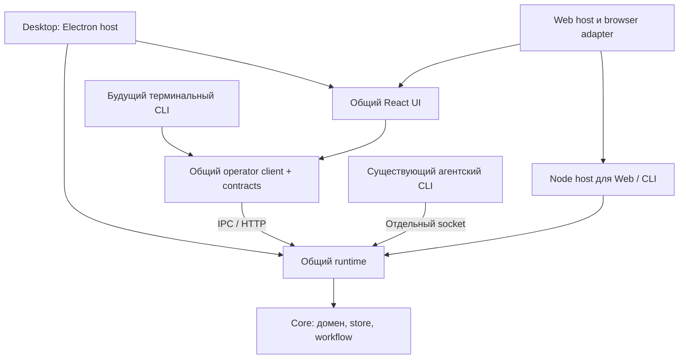

# Общий фундамент Desktop, Web и CLI

Состояние на 5 октября 2026: общий фундамент и Web для своего Linux-сервера реализованы.
Desktop и самостоятельный Node/Web host собираются и проверяются без зависимости backend от Electron.
Поставка первого отдельного Web 2.0.0 готова; следующая приёмка — реальный сервер/HTTPS.
Человеческий CLI остаётся следующей отдельной разработкой.
Результаты проверки базы — [orca-foundation-progress.md](orca-foundation-progress.md),
подробные алгоритмы и протоколы — [architecture.md](architecture.md).
Точка остановки и порядок следующих проектов после 2.0.0 —
[orca-development-handoff.md](orca-development-handoff.md).

## Где находится общая логика

| Каталог | Ответственность | Окружение |
| --- | --- | --- |
| `packages/core` | Модель, store, миграции, переходы workflow, события, промпты | Чистые доменные модули; файловый store используется backend |
| `packages/contracts` | Общие DTO, команды, ошибки, protocol/schema/capabilities | Browser-safe, без Electron, Node backend и store |
| `packages/runtime` | Application commands, workflow effects, workers/coordinator, Git, файлы, настройки, диалоги и PTY lifecycle | Node.js, без Electron, React и Desktop |
| `packages/client` | Typed operator client, HTTP/IPC, retries, selection, snapshot/replay, binary и writer channels | Browser-safe, без React и Node backend |
| `packages/ui` | React-компоненты, CSS, ru/en, assets, presentation helpers, общие theme/window tokens | Browser-safe; получает client/platform от host |
| `apps/desktop` | Electron lifecycle, окна, меню, трей, уведомления, updater, IPC/preload, native actions | Electron host общего backend и UI |
| `apps/web` | HTTP auth/CSRF, browser host, preview, Linux installer и systemd updater/recovery | Node24 + браузер |
| `apps/headless` | Запуск того же backend, выбор профиля, native PTY и приватный operator endpoint | Самостоятельная установленная Node.js 24 программа |
| `packages/cli` | Существующий агентский `orca-board`, прежние команды и HELP | JS без npm-зависимостей; Node из Desktop или Node host |



Бизнес-правила исполняются на стороне runtime, а интерфейс отображает результат
и отправляет команды. Host передаёт пути, trusted principal/policy, перевод ошибок
и native ports. В runtime уже находится весь основной цикл project → задача →
координатор/воркер → workflow → запрос человеку → review/merge.
Git, файловая система и процессы агентов работают на машине владельца runtime.
При подключении браузером они работают на сервере.

Есть совместимый UI API: Desktop передаёт старые методы preload через injected
client/platform, CRUD групп уже использует typed operator client. Общие компоненты
не обращаются напрямую к Electron. packages/client/src/ui.ts отображает остальные методы
на operator commands; Web platform выбирает серверные папки и скачивает файлы.

## Что обеспечивает backend

- Один владелец физического профиля до backup и миграций; Desktop и Node host
  не могут одновременно писать в один профиль.
- Явный project/client/actor context и host authorization; выбор проекта и диалога
  принадлежит подключённому клиенту.
- Handshake protocol/schema/capabilities, revision checks, durable request identity
  и повторная доставка без автоматического повторения неопределённого native эффекта.
- Bounded snapshot/replay для операторов, отдельно от событий агентского `check`.
- PTY переживает отключение наблюдателя; ввод требует writer lease и sequence,
  повторный пакет не вводится дважды.
- Async Git с отменой и очередью по canonical commonDir; stale guards и effect journal
  не дают позднему результату менять уже другую задачу/этап.
- Graceful stop: закрытие входов и native ресурсов до освобождения профиля.

Файловое JSON-хранилище сохраняется. Не всякая локальная операция стала асинхронной:
например, чтение/запись dialog repository и обнаружение версии агента остаются
синхронными. Это не привязывает backend к Electron; массовый multiuser-сервис,
сетевой файловый профиль и масштабирование пока не входят в его назначение.

## Сборка и запуск Node host

Из worktree под Node.js 24 и pnpm 10.33.0:

```sh
pnpm install --frozen-lockfile
pnpm --filter @orca-board/headless build
```

`apps/headless/dist` содержит ESM backend, skills, агентский CLI и отдельный
`package.json`. Скопируй этот каталог **за пределы workspace**; ниже пути служат
примером и заменяются абсолютными путями вашей машины:

```sh
cp -R apps/headless/dist /absolute/path/orca-node
cd /absolute/path/orca-node
npm install --omit=dev
node start.mjs /absolute/path/orca-profile
```

Native `node-pty` устанавливается здесь для Node.js 24. Не копируй `node_modules`
Desktop: его native модуль собран для Electron. В зависимости от платформы установка
native модуля может потребовать системные средства сборки. Нужны Git и установленные,
авторизованные CLI-агенты в окружении пользователя сервера.

Каталог профиля берётся из первого аргумента, затем `ORCA_DATA_DIR`, иначе из
`~/.orca-board/profiles/default`. Требуется абсолютный путь. Host создаёт каталог;
для экспериментов используй отдельный профиль. Перенос существующих Desktop данных
и абсолютных worktree/file paths на другую машину требует отдельной процедуры.

Endpoint слушает loopback на выбранном порту. URL, bearer token, agent socket path
и owner id записываются в `operator-endpoint.json` профиля с mode `0600`.
Это credential-файл, а не конфигурация для публикации в браузере. Agent socket
отдельный: агентам operator token не передаётся. `SIGINT` / `SIGTERM` запускают
graceful stop. `startHeadless()` также доступен из установленного `index.mjs` для host.

## Web для собственного сервера и будущий CLI

Общий backend не нужно переписывать повторно. `apps/web` реализует браузерный
entrypoint общего UI, общий typed UI adapter, авторизацию серверной сессии
и подключение trusted principal. Для одного-двух пользователей
достаточно одного server owner и одного профиля с клиентским выбором проектов.

К Web относятся HTTPS/reverse proxy и домен, запуск после перезагрузки сервера,
хранение credentials, reconnect/терминалы в браузере, upload/download вместо
локального Finder/Explorer, выбор серверного каталога проекта и понятные права
доступа. Эти адаптеры и native Linux-поставка реализованы;
реальное развёртывание ждёт выбора сервера. Общедоступный сервис,
регистрация пользователей, tenant isolation и биллинг оставлены на будущее.

Терминальный чат CLI позже подключится к тому же operator client. Его отображение,
горячие клавиши и запуск/подключение к host будут отдельными; существующий агентский
CLI сохраняет свои команды и не заменяет этот будущий пользовательский интерфейс.

## Независимая разработка и выпуски

Общие private пакеты встраиваются в сборки из выбранного SHA. Feature PR идут в develop;
изменение общего кода само по себе не публикует приложения. Каждый продукт включает его
в следующий собственный выпуск. Последнее решение пользователя — независимые версии:
Desktop vX.Y.Z/root+apps/desktop, Web web/vX.Y.Z/apps/web, будущий CLI cli/vX.Y.Z/packages/cli.
Web/CLI не становятся GitHub Latest и не содержат Desktop update feed.

Web реализован в apps/web: auth/preview/browser platform, общий headless/runtime и typed UI adapter.
Linux artifact, installer, browser updater с отдельным worker/recovery готовы; [установка](web.md).
release.yml сохраняет Desktop-поставку, web-release.yml собирает и проверяет отдельный Linux-пакет.
Первый Web release не опубликован и не требует нового Desktop. Реальная server/DNS/systemd приёмка
остаётся после выбора сервера. [Git Flow](git-flow.md) и [релизы](releasing.md) описывают порядок.
