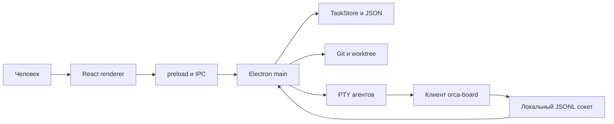
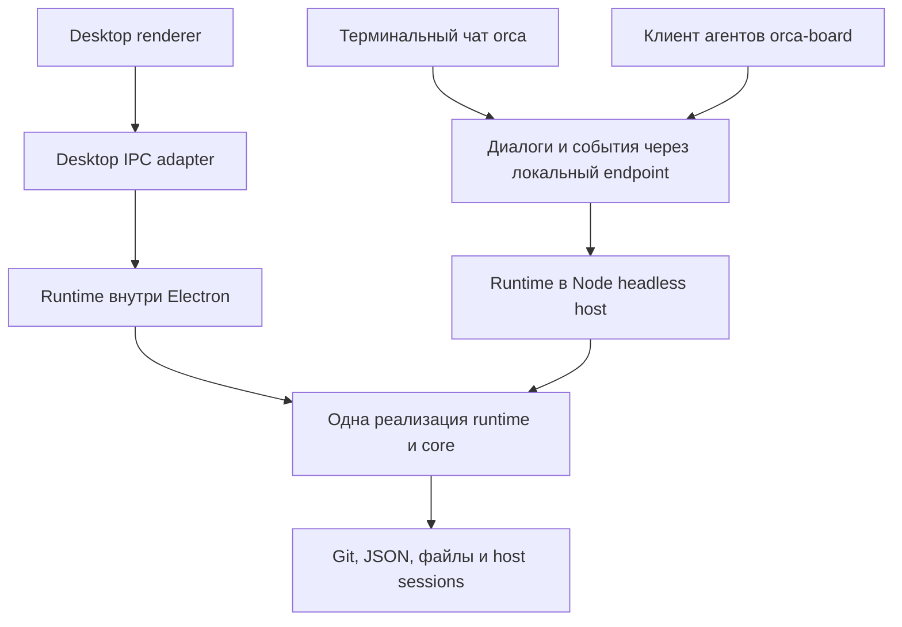

# Архитектура самостоятельного Orca CLI

Дата исследования: 2 октября 2026. Основа: `origin/develop`, коммит `6275e1d`, версия приложения `1.1.2`. Это предложение для обсуждения и планирования; описанные новые пакеты, методы и команды ещё не реализованы.

Пользователь уточнил основной сценарий: самостоятельный **интерактивный чат в терминале, как Codex или Claude**, установленный на удалённом сервере и используемый по SSH. Человек ставит цели и управляет оркестрацией естественным языком; правила, workflow и функции совпадают с desktop. Команды остаются дополнительным интерфейсом для явных операций и автоматизации. Подключение desktop к серверу можно добавить позднее.

Рекомендуемое решение: оставить один монорепозиторий, выделить исполнительный Node.js runtime и диалоговый сервис из `desktop/main`, использовать их внутри Electron и в отдельном headless-процессе. Пользовательский CLI становится терминальным клиентом диалога и событий этого процесса. Существующий `orca-board` сохраняется как инструмент ассистента, координаторов и воркеров. Структурированные протоколы **ассистента** нужны уже первому чат-выпуску; перевод рабочих агентов с PTY на такие протоколы остаётся последующим этапом.

Для передачи обсуждения в другой чат: [краткий контекст и принятые направления](2026-10-02-orca-cli-handoff.md), [план реализации](../plans/2026-10-02-orca-cli.md). Это сохранённая архитектурная основа; поручение на реализацию отдельно не дано.

## Что исследовано

Прочитаны правила `AGENTS.md`, `CLAUDE.md`, Git Flow и CONTRIBUTING; структура workspace, сборка Electron и CI; архитектурная документация и контракты workflow, глобальных задач, запросов к человеку и чата ассистента. Выводы сверены с исходниками store, проектов, IPC и сокета, запусков агентов, PTY, двух исполнителей workflow, Git, веток прогонов, persistence, изображений, показов, статистики, транскриптов и соответствующих тестов. Самостоятельный серверный runtime в рамках исследования не запускался, реальные платные сессии агентов не создавались.

На изученном коммите production TypeScript в core занимает 26 файлов и 10 811 строк, в desktop/main — 58 файлов и 15 418 строк, без тестов. Эти числа показывают масштаб границы переноса, но не являются оценкой трудозатрат: часть main относится исключительно к оболочке приложения.

## Как устроено приложение сейчас

### Процессы и владение состоянием

Electron main владеет всеми TaskStore, каталогом проектов, библиотекой типов задач, PTY агентов и сокет-сервером. React renderer получает снимки и вызывает API через preload/IPC. Агенты — установленные CLI-программы, дочерние процессы приложения; Orca не обращается к API моделей для выполнения рабочих задач.



Сокет — Unix socket на macOS/Linux и named pipe на Windows. Его адрес можно переопределить `ORCA_SOCKET`. По умолчанию он находится в `~/.orca-board/orca.sock`, тогда как состояние desktop находится в платформенном `appData/orca-board`. Таким образом, каталог сокета и каталог состояния уже являются разными сущностями.

### Core

`packages/core` — правильный задел для переиспользования. Он содержит:

- Task, Run, Dispatch, Question, HumanRequest, роли, приоритеты, события и историю;
- TaskStore, миграции снимков и доменные проверки;
- модель, валидацию, миграции и чистые переходы workflow;
- библиотеку заготовок типов задач, разрешение настроек типов и снимки;
- построение промптов и реестр способов запуска CLI-агентов;
- расчёты статистики, времени, стоимости и представления глобальных задач.

Store работает через интерфейс `Persistence { load, save }`. Он не знает файловой системы, Electron и места хранения проектов. Это позволяет сохранить core общим для runtime и renderer. Добавлять Node-импорты в browser-safe модули нельзя.

Важно различать **переход состояния** и **исполнение эффекта**. Например, `finishStage()` в store определяет следующую ноду; проверяющего, запрос человеку, мерж и запуск координатора создаёт `workflow-run.ts`. Прямое использование одного core в новом CLI не воспроизводит приложение.

Сегодня core публикует исходный TypeScript (`main: src/index.ts`), его build ничего не собирает. Electron собирает его через alias. Обычный npm-пакет CLI должен иметь отдельный путь сборки; test loader и возможности локального Node по чтению TypeScript не заменяют поставляемый JS-артефакт.

### Исполнительный слой в desktop/main

В main находятся переносимые части и композиция приложения:

| Файл | Ответственность | Что мешает самостоятельному использованию |
|---|---|---|
| `projects.ts` | Проекты, настройки, типы, шаблоны нод, ленивое открытие store, миграции | Импорты DTO и констант из desktop/shared, смешение общих и desktop-настроек |
| `persistence.ts`, `backup.ts` | Атомарные JSON-записи, предупреждения, резервирование перед миграцией | Нужен независимый lifecycle и блокировка владельца состояния |
| `worker.ts` | Контекст, worktree, запуск воркера и координатора, dispatch | `electron.app`, `resourcesPath`, поиск встроенного CLI, Node из Electron |
| `pty.ts` | Реестр PTY, ввод, размер, хвост вывода, живость, callbacks выхода | Глобальная Map и доставка через BrowserWindow; native-зависимость |
| `workflow.ts` | Старые прогоны, входящие и пути подзадач | Исполнитель уже имеет deps; импортирует соседние сервисы main |
| `workflow-run.ts` | Граф глобальной задачи, gate, ask, decision, fork/join, Git | Исполнитель имеет deps, но композиция и запуск находятся в index |
| `git.ts`, `run-branch.ts`, `review.ts` | Ветки, worktree, merge, diff, принятие и возврат | Частично синхронные операции, DTO из shared/ipc, сообщения main |
| `socket.ts` | 76 уникальных методов, JSONL, ожидание вопросов и событий | Транспорт совмещён с прикладными обработчиками; прямые импорты PTY |
| `attachments.ts`, `run-images.ts`, `showcase-snapshot.ts` | Изображения, файлы результата и их снимки | Корни каталогов передаёт Electron-композиция |
| `docs.ts`, `docs-view.ts`, `project-files.ts`, `rules.ts` | Безопасное чтение файлов проекта и правил | DTO desktop/shared; открытие файлов ОС выполняется отдельно в index |
| `stats.ts`, `transcripts.ts` | Статистика и чтение транскриптов Claude/Codex | Контекст проектов собирается в index; нужны пользовательские home/env |
| `assistant-conversation.ts`, `assistant-session.ts` | Двусторонние сессии Claude/Codex/ACP | Политика ассистента зашита в lifecycle; типы находятся в desktop/shared |
| `index.ts` | Wiring, worker/coordinator guards, hooks store, recovery, таймеры | Все общие действия смешаны с окнами, IPC, tray, updater и Notification |

Размер важных файлов: index — 1310 строк, projects — 1535, socket — 1172, workflow-run — 1072. Перенос должен выделить их ответственность, сохранив действующие сценарии и тесты; общий runtime не должен стать копией большого index.

### Реальный путь выполнения

1. ProjectManager добавляет Git-репозиторий, нормализуя путь через `git rev-parse --show-toplevel`; проект получает id от корневого пути и тип по умолчанию.
2. Глобальная задача соответствует Run. Тип даёт роли, правила, разрешения и граф. Run сохраняет снимок типа и workflow; настройки ролей существующего типа разрешаются вживую при следующих запусках, а удалённый тип читается из снимка.
3. При запуске координатора `ensureRunBranch()` создаёт отдельную `feature/*` и worktree глобальной задачи от текущей базы проекта. Root не переключается. Нужен хотя бы один Git-коммит.
4. Запускается агент роли coordinator. Это может быть Codex: в реализации нет обязательной зависимости от Claude, хотя Claude задан по умолчанию. После запуска исполнитель входит в граф и генерирует `stage_started`.
5. Координатор создаёт подзадачи текущей ноды work и запускает ready-задачи. Runtime проверяет роли этапа, зависимости и доступность агента.
6. Воркер работает в отдельном worktree на `orca/<taskId>` от ветки глобальной задачи. Система строит промпт и передаёт `ORCA_SOCKET`, `ORCA_PROJECT`, `ORCA_TASK_ID`, `ORCA_DISPATCH_ID`; координатор дополнительно получает `ORCA_RUN_ID`.
7. Воркер сдаёт результат через клиентский `done`. Dispatch закрывается, данные сохраняются. Это не равнозначно исчезновению PTY: интерактивный агент может ещё ждать ввода.
8. Эффекты workflow обрабатываются через отложенный callback, а не вложенно внутри сохранения store. Подзадача идёт по `work.subflow`; по умолчанию результат сливается в ветку прогона, затем задача закрывается.
9. После закрытия подзадач координатор получает `stage_tasks_done` и завершает этап. Движок запускает gate/ask/decision, создаёт human approval, выполняет Git или проходит к следующей work/end. Fork хранит несколько позиций в Run.lanes; старый и новый движки разделяют события через `taskEngine()`.
10. При завершении закрываются воркеры, отложенно закрывается координатор, а worktree завершённой глобальной задачи убирается при отсутствии живых агентов. Ветка остаётся. Нода Git может делать push, но универсальной PR/CI-интеграции приложение не имеет.

### Состояние и восстановление

ProjectManager хранит `projects.json` и доски `boards/<projectId>.json`; отдельно лежат изображения глобальных задач, вложения и снимки показа. При запуске выполняются backup и миграции. Записи JSON заменяют файл через rename; повреждённые файлы сохраняются в `.corrupt-*`, предупреждения доступны приложению.

Загрузка TaskStore **считает прежние PTY погибшими**: незакрытые dispatch становятся unknown, задачи in_progress возвращаются в ready. ProjectManager эскалирует вопросы, которые раньше ждали координатора. Это допустимо для перезапуска владельца процессов, но означает, что CLI-команда не может открывать новый store на каждый вызов. Даже чтение через такой store затронуло бы живые задачи другого владельца.

Текущий `writeFilesAtomic()` откатывает известную ошибку записи нескольких файлов, но не обеспечивает транзакцию при аварийном завершении процесса между rename. Этот предел нужно сохранить в документации и проверках, а не обещать полную транзакционность.

### Существующий CLI

`packages/cli/bin/orca-board.js` — 516 строк JS без npm-зависимостей. Он разбирает argv, читает локальные файлы параметров, добавляет контекст ORCA из env, посылает JSON и печатает результат. Для обычных команд stdout уже JSON; флаг json сейчас удаляется и не переключает формат. Код выхода различает серверную/аргументную ошибку и ошибку подключения.

В desktop клиент копируется в `Resources/cli`. Shell/cmd-обёртки запускают его системным Node или Node из Electron через ORCA_NODE. Запрет на импорты core и npm в этот файл — действующее инженерное правило, обусловленное поставкой. Новая версия продукта не должна нарушить его скрытым импортом runtime.

CLI уже умеет проекты читать/выбирать/удалять, управлять задачами, глобальными задачами, воркерами, вопросами и запросами, ролями, правилами и многими настройками, читать и изменять workflow. Работающие команды и ORCA-контекст имеют ценность как контракт с агентами, их следует сохранить.

### Структурированные сессии ассистента

Для ассистента уже реализованы Claude stream-json, Codex app-server и ACP для нескольких агентов. Amp и shell используют терминал. Сессии поддерживают сообщения, interrupt, разрешения и вопросы, проверку поздних ответов и ограничения кадров. Это хороший исходник для общего транспорта.

Однако его нельзя сразу использовать как worker driver: код удаляет ORCA_PROJECT/RUN_ID/TASK_ID/DISPATCH_ID из env, выставляет роль assistant, использует нейтральный cwd и собственный режим разрешений. Сначала нужно отделить протокол от политики роли. Provider approval также отличается от HumanRequest проверки результата: у него есть живой provider request id и turn/thread, а после смерти процесса ответить на него нельзя.

## Какие варианты возможны

### Основной интерфейс: разговор с оркестратором

Основной сценарий: по SSH человек запускает `orca`, видит диалог и пишет «сделай авторизацию; разработчик Codex, проверяющий Claude; используй обычный workflow». Ассистент находит проект и тип, уточняет только недостающие параметры, создаёт Run и запускает работу. Человек видит реальные события, вопросы, статусы и результаты, может продолжать разговор, менять правила или переходить к конкретной сессии. Это предполагаемый интерфейс будущего продукта, не существующая команда.

Для этого уже есть подходящая основа: `skills/assistant.md` прямо описывает управление доской естественным языком через существующий CLI. `assistantLaunch` объединяет встроенную инструкцию, пользовательский prompt и язык; `AssistantSession` управляет репликами, interrupt, snapshot и взаимодействиями; `createAssistantConversation` имеет двусторонние provider transports. Сейчас delivery привязан к IPC/окну и session живёт в памяти. Их следует вынести в runtime, не создавать новый независимый оркестратор моделей.

Три ответственности остаются отдельными:

- **Ассистент разговора** понимает просьбу человека и вызывает инструменты Orca. Его provider/model выбираются отдельно от ролей workflow. Он не заменяет воркеров и не переписывает репозиторий вместо них.
- **Runtime Orca** проверяет команды и выполняет действующие правила, workflow и side effects. Успех определяется результатом сервиса и доменным состоянием, а не текстом ответа LLM.
- **Координаторы и воркеры** выполняют задачи в существующих контекстах Run/Dispatch/worktree, используя назначенные роли и модели.

В первом выпуске общая схема инструментов сохраняется: ассистент вызывает dependency-free `orca-board`, который обращается к runtime. Не требуется сначала писать новый agent SDK, подключаться напрямую к API моделей или вводить MCP для всех providers. RPC, машинный CLI и будущие typed tools должны сходиться в одних прикладных сервисах; добавление отсутствующих возможностей отражается в HELP и общей инструкции ассистента.

Терминальный клиент показывает поток ответа, краткие tool-вызовы и реальные события выполнения. Пока человек редактирует ввод, фоновые обновления не уничтожают строку и не повторяют отправку. Подтверждения, вопросы provider и HumanRequest результата визуально различаются и адресуются конкретным request/session/turn. Текущие правила подтверждений сохраняются; вопросы не отвечаются автоматически только из-за reconnect. Ассистент не запускает `check --follow`: read-only наблюдение выполняет приложение и отображает его независимо от LLM.

Нужны многострочный ввод, история, отмена текущего ответа, доступ к результатам и минимальные slash-команды: `/help`, `/project`, `/runs`, `/requests`, `/attach`, `/resume`, `/exit`. Это проектируемые команды. Свободный текст — основной путь; slash-команды позволяют явно выбрать объект/ответить/подключиться без обязательного обращения к модели. В первой версии достаточно чата с прокручиваемым transcript; полноэкранная копия канбан-доски не требуется.

Текущий выбранный проект принадлежит диалогу, а не глобальному active project desktop. Начальный выбор — явный флаг, ORCA_PROJECT или зарегистрированный repo текущего cwd; без подходящего проекта чат предлагает выбрать/добавить его. Инструменты всегда получают явный project id; неоднозначную цель ассистент уточняет. Рабочие cwd воркеров и нейтральный cwd ассистента сохраняются разными.

Daemon владеет диалогом и provider process; терминал является подписчиком. Разрыв SSH не останавливает работу, следующий вход восстанавливает snapshot/stream и незавершённые вопросы. После рестарта самого daemon нужны сохранённый журнал диалога и provider binding. Codex app-server поддерживает `thread/resume`; нынешний код Orca делает `thread/start`, следовательно resume надо реализовать, а не считать готовым. [Официальный App Server](https://developers.openai.com/codex/app-server). У каждого provider отдельные capabilities: если продолжение недоступно, интерфейс явно предлагает новый диалог с восстановленным контекстом, не выдавая его за ту же сессию. Журнал чата не заменяет состояние Run/Task и не проигрывает mutating tool-вызовы заново.

Открытие интерактивного `orca` подключается к локальному host и может запустить свой headless профиль, если он ещё не работает; живого несовместимого владельца не заменяет. `/exit` закрывает интерфейс. Остановка сервиса и агента — отдельные явные действия. Для systemd остаётся foreground service mode. Команды для scripts и JSON остаются доступны, но чат и действия с запросами входят уже в MVP.

### Исполнительная архитектура

| Вариант | Преимущества | Недостатки | Вывод |
|---|---|---|---|
| Расширить клиент и оставлять Electron владельцем | Минимум переноса, можно быстро добавить команды | Сервер всё равно требует Electron и его окружение; CLI зависит от жизненного цикла desktop | Подходит как улучшение нынешнего клиента, не закрывает подтверждённый сценарий |
| Отдельный CLI-проект со своей оркестрацией | Можно выбирать новый стек и не трогать desktop | Два store, два исполнителя workflow, разные миграции, промпты и исправления; общий core решает только часть проблемы | Не рекомендуется |
| Общий runtime в монорепо, два host и общий прикладной API | Единые бизнес-правила, headless работает без GUI, перенос по этапам, основа для remote | Нужно выделить зависимости, lifecycle, контракт и сборку, покрыть границы тестами | Рекомендуется |

Выполнение всего runtime внутри каждой короткой команды CLI тоже не подходит: процессы должны переживать выход клиента, check/ask ждут долго, а recovery не должен повторяться на каждом list. Нужен один долгоживущий владелец состояния и процессов.

## Целевая структура

Предлагаются три новых границы: общий runtime, browser-safe контракт и headless host. Это названия для будущей реализации.

```text
packages/core/       существующая модель, store, чистые функции и промпты
packages/contracts/ DTO прикладного API, ошибки, версия протокола, события и capabilities
packages/runtime/   проекты, persistence, workflows, Git, диалоги, сессии, файлы, recovery
packages/cli/       терминальный чат orca, дополнительные команды и автономный клиент агентов
apps/headless/      запуск runtime, локальный endpoint, lifecycle и service mode
apps/desktop/       Electron host, окна, IPC, preload, renderer и интеграции ОС
skills/             общий источник инструкций агентов
```



Схема показывает две возможные установки runtime, а не два владельца одной доски. Desktop и headless имеют отдельные профили по умолчанию. Для явно общего каталога допускается только один живой owner.

### Направление зависимостей

- Core не зависит от contracts, runtime и desktop.
- Contracts использует domain-типы core, но не Node/Electron; desktop IPC переэкспортирует общие DTO для совместимости.
- Runtime зависит от core/contracts и Node.js; ему запрещены импорты из apps/desktop.
- Hosts передают пути, инструкции, логгер, locale и SessionHost; способы доставки в окно/терминал находятся в адаптерах.
- Пользовательский CLI обращается к сервису; renderer продолжает использовать preload и IPC.
- Существующий `orca-board.js` остаётся JS-клиентом без npm-зависимостей. Сборка отдельного пользовательского входа может быть TypeScript → JS.

Contracts оправдан уже существующим большим shared/ipc.ts: иначе headless получит обратную зависимость на desktop. Не требуется сразу переносить 1142 строки: переносить общие DTO по используемым сервисам, оставляя Menu, window, updater и остальные Electron-возможности у desktop. Чистые ограничения файлов и формат результата также должны быть доступны runtime без импорта desktop/shared.

### API и композиция

Runtime должен иметь конструктор `createOrcaRuntime(options)` с явными `dataDir`, `socketPath`, `agentCliBinDir`, `nodeExecutable`, `builtinPrompts`, `sessionHost`, `logger`, `language`, `version`. Сервисам нужны методы startWorker/startCoordinator/resolveRequest/review/finishStage, а не прямой доступ клиента к TaskStore.

Первым переносится wiring из index: guards запуска, deps исполнителей, hooks событий, автозакрытие, доставка ответов, cleanup worktree, recovery и интервалы. Все они должны работать при отсутствии окна. Hook уведомлений передаёт событие адаптеру desktop; headless пишет диагностическое сообщение/событие.

IPC и socket затем вызывают одни прикладные сервисы. Параметры транспорта переводятся в явный `CommandContext { projectId?, actor }`: actor отвечает за историю и права операции. Глобальный active project остаётся предпочтением UI; новый CLI разрешает проект через явный флаг, ORCA_PROJECT или текущий cwd, а неоднозначность требует явного выбора. Совместимый клиент сохраняет старое разрешение контекста.

## Минимум для самостоятельной версии

Первая функциональная версия включает интерактивный чат оркестратора, проекты, типы/роли/правила, workflow, глобальные и рабочие задачи, запуск/stop/restart агентов, вопросы и приёмку, read-only наблюдение, терминальное подключение, историю диалога и сохранённые логи. Она должна работать на Linux без дисплея и установленного Electron.

| Область desktop | Текущий socket/CLI | Что нужно самостоятельному продукту |
|---|---|---|
| Проекты | list, set-active, remove, часть настроек | Добавление по явному серверному пути; get; диагностируемый выбор по cwd |
| Рабочие и глобальные задачи | Большая часть операций уже есть | Полная карточка, type change до старта, global accept/return через сервисы |
| Координатор и воркеры | start/stop/restart/read, done/ask | Те же действия без Electron; управление сессиями и attach/detach |
| Воркфлоу | schema/get/validate/set/create/show | Сохранить revision-проверку и оба движка; экспорт/импорт файла |
| Типы и роли | Основные CRUD, permissionMode, rules | Полный перенос типа через существующий TaskTypeFile; полный доступ владельца к параметрам роли |
| Шаблоны нод | list/delete | Создание/изменение через JSON, с той же валидацией |
| Вопросы и запросы человеку | get/list/resolve/forward | Те же правила, в том числе approval без taskId; вывод полного контекста |
| События и история | events.list и check | Read-only follow с cursor и фильтрами; отдельно потребление событий координатором |
| Статистика | IPC | CLI-доступ к project/task/global, сохранение ограничений точности транскриптов |
| Изображения и показ | done умеет showcase; многие действия IPC | Вложения по файлам, снимки, list/read/export результатов после удаления worktree |
| Файлы и документы | IPC | Безопасные list/read/export, тот же контроль путей и symlink |
| Ассистент доски | IPC и отдельные транспорты | Основной чат-интерфейс MVP: сессия, stream, interrupt, provider interactions и reconnect |
| Git корня | IPC | Branch/fetch/pull/checkout с теми же guards; существующие Git-ноды workflow |
| Группы проектов | IPC | CLI CRUD и связь проектов; меньший приоритет, но входит в полную parity |
| Окна, tray, тема, Finder и автообновление .app | Electron | Их смысл заменяется форматами вывода, логами, экспортом файлов и обновлением CLI-пакета |

Из этой матрицы следует, что независимость от Electron и полное покрытие функций — разные этапы. MVP должен позволять пройти рабочую задачу целиком **из чата**, включая вопрос человеку и просмотр результата; полная parity расширяет этот цикл статистикой, библиотеками, файлами и прочими операциями. Ассистент не откладывается до parity.

## Как запускаются агенты

Для первой версии сохранить PTY запуска рабочих агентов и координатора. Это использует текущие AgentSpec.invoke, инструкции, ORCA-контекст и разрешения, поддерживает весь существующий реестр и не заставляет одновременно переписать workflow и provider-интеграции.

Следующая версия расширяет SessionHost рабочих агентов драйверами: PTY, Codex app-server, Claude stream-json и ACP. Способ запуска выбирается по capability агента, а не одинаковым флагом для всех. Структурированные драйверы полезны для машинного мониторинга, точного статуса turn и provider permissions. Они переиспользуют уже вынесенный протокол assistant-conversation; cwd, env и политика прав передаются от рабочей роли.

Документация OpenAI подтверждает, что app-server предназначен для интеграций: stdio передаёт JSONL, разрешения приходят отдельными запросами с threadId/turnId. Для одноразового запуска существует exec с JSONL-событиями. Поэтому для интерактивного управления сессиями Orca рекомендует app-server, а exec может позднее служить отдельным batch-драйвером. [App Server](https://developers.openai.com/codex/app-server), [Non-interactive mode](https://developers.openai.com/codex/noninteractive).

Не приравнивать provider turn.completed, выход процесса или тишину PTY к успешной сдаче работы: доменная сдача определяется контрактом done и текущим dispatch. Официальный transport Codex не заменяет store и workflow Orca.

## Daemon и состояние

### Lifecycle

Сначала нужен foreground service mode, пригодный для systemd и других supervisor. Пользовательский daemon start — оболочка над ним; команды status/stop используют handshake сервиса. Команда клиента завершилась или SSH отключился — агенты продолжают работать. Выход attach по detach не вызывает stop агента.

Профиль headless по умолчанию: `~/.orca-board/profiles/default` для состояния, отдельный короткий socket path в `~/.orca-board/run/`. Переопределение через явные options/environment; Windows получает эквивалентные каталог и named pipe. Длина Unix socket должна проверяться до старта, путь не строится из произвольного длинного имени профиля. Пути в профиле задаются host, core не вычисляет home.

Desktop сохраняет существующий userData и формат файлов. Его endpoint остаётся совместимым. Нельзя автоматически переносить пользовательскую доску в headless профиль: для этого нужна отдельная операция импорта при остановленном владельце. На другом сервере пути проектов/worktree/вложений отличаются; перенос файлов JSON сам по себе не создаёт корректную установку, проекты нужно сопоставить с локальными репозиториями.

### Один владелец

До backup и открытия ProjectManager host получает блокировку канонического dataDir. Локальный endpoint имеет собственную проверку владения: живой чужой socket не удаляется. В текущем startSocketServer существующий socket удаляется без проверки; этого нельзя наследовать в самостоятельном daemon.

Проверка owner включает идентификатор экземпляра, PID и успешный runtime handshake; одного PID недостаточно из-за повторного использования. Второй startup должен отказать, а не открыть store или затереть endpoint. Прерванный запуск убирает только принадлежащие ему lock/socket. Старый desktop начнёт уважать общий lock в той же миграции runtime.

### Перезапуск

В первой версии PTY не переживает рестарт owner. SIGTERM закрывает новые мутации, завершает ожидания клиентов, останавливает дочерние процессы и timers, фиксирует результат, закрывает endpoint и освобождает lock. Сбой процесса оставляет сохраняемые задачи, вопросы, workflow positions, ветки и worktree; startup reconciliation помечает запуски interrupted/unknown согласно текущей модели и предлагает явный restart.

Не обещать продолжение прежней живой PTY по PID или автоматический повтор всей работы. Для orphan-процессов нужна проверяемая ownership/cleanup-политика; systemd service можно настроить так, чтобы останавливалась вся группа сервиса. Восстановление эффектов workflow должно сохранить текущую идемпотентность и проверять актуальность ноды/захода/lane, прежде чем применять поздний результат.

### Хранение

На этапе выделения runtime оставить текущий JSON и миграции. Обязательны lock owner, атомарная запись и backup. База SQLite может стать отдельным улучшением после замера размеров и частоты записи; одновременно с извлечением runtime она значительно увеличивает объём совместимости.

Текущие events и dispatch history растут; save переписывает снимок целиком, events.list отдаёт весь журнал. Для серверной нагрузки добавить пагинацию/фильтры чтения и отдельные ротируемые логи PTY с пределом диска. Retention событий, которые нужны координатору или миграциям, нельзя вводить простым удалением старых элементов. При пересечении установленного лимита логов сохраняется явная отметка усечения, а не повреждённый файл.

## Протокол и пользовательский CLI

### Совместимость

Существующая линия `{id, method, params, projectId, dispatchId, taskId}` / `{id, ok, result|error}` остаётся рабочей. Это собственный RPC envelope поверх JSONL, а не стандартный JSON-RPC 2.0. Начинать с полной замены транспорта не нужно.

Новый handshake сообщает runtime version, protocol major, поддерживаемые методы/capabilities и роль владельца. Новые ответы добавляют машинный code и details, сохраняя строку error старым клиентам. Дополнительно проверяются форма запроса, размер кадра, пределы чисел и наличие параметров. Для streams нужны управление очередью вывода, отмена при disconnect, ограничения памяти и завершение ожиданий при shutdown.

### События

`check` вызывает `consumeEvents()`. В каждом событии хранится один consumedBy: указание другого consumer не делает копию доставки. Отдельный человеческий монитор на check способен забрать события у координатора.

Сегодня есть непотребляющий events.list, но это весь массив без пагинации и подписки. Новый наблюдатель должен иметь независимый cursor и replay, получать новые события без изменения consumedBy. Координатор продолжает старый consume-контракт. При переподключении observer отдаёт cursor; если журнал уже не содержит нужную позицию, API возвращает явный cursor-expired и инструкцию перечитать snapshot. Снимок и stream согласуются через единую границу sequence, чтобы событие не терялось между list и subscribe.

### Терминалы

Сервисный SessionHost отделяет реестр, вывод, exit, write, resize, tail и isAlive от BrowserWindow. Desktop подписывается и отправляет существующие pty:data/exit и terminals:changed. CLI attach переводит свой stdin в raw mode, передаёт ввод/resize, восстанавливает настройки терминала в finally и имеет явное сочетание detach. Отключение viewer не завершает сессию; kill/interrupt являются отдельными действиями.

Один подключённый пользователь получает право ввода/resize; остальные могут читать, пока writer не отпущен. Обычный runtime heartbeat или поток логов не должен продлевать «последнюю активность агента». Терминальный журнал хранит raw output для replay и отдельное plain представление для logs; хвост очищенного текста нельзя считать полноценным экраном TUI после переподключения.

### Команды и вывод

Новый пользовательский entrypoint `orca` без подкоманды открывает чат. Дополнительные подкоманды организуют daemon, проекты, типы, роли, workflow, глобальные задачи, воркеры, сессии, запросы, события, файлы и статистику. Старый `orca-board` остаётся машинным entrypoint, используемым skills. Новые команды нужно сначала реализовать и включить в HELP, затем документировать; ниже только предполагаемый интерфейс будущего `orca`, не инструкция запуска существующего продукта.

```text
orca                         интерактивный чат
orca --project <id>          чат с явным проектом
orca daemon serve / start / status / stop
orca projects add / list / get
orca roles update
orca global create / start / get / accept / return
orca worker start / stop / restart
orca sessions list / attach / logs
orca request list / get / resolve
orca events follow
orca stats project / task / global
```

Точный набор флагов должен зафиксироваться при реализации конкретной команды. JSON-режим пишет только данные в stdout, сообщения и ошибки — stderr; stream использует JSONL. Человек в TTY получает таблицы и понятные статусы; в pipe формат по умолчанию JSON. Вывод не зависит от цвета/ширины при явном JSON.

Целевые exit codes: 0 — успешная операция; 1 — прикладная ошибка; 2 — отсутствие связи, как у совместимого клиента; 3 — неверные аргументы; 4 — конфликт/revision; 5 — требуется явное подтверждение; 6 — несовместимый protocol/capability. Уже существующий клиент сохраняет свои коды. Долгий watch завершается по сигналу; disconnect attach оставляет worker живым.

### Права владельца и агента

Сейчас socket не имеет аутентификации роли клиента. ORCA_ROLE и dispatchId помогают адресовать запрос, но не являются доказательством полномочий. Поля extraArgs вырезаются из всех socket-ответов, потому что там бывают пути/токены; менять их может только человек через IPC.

Полная CLI parity требует отдельного локального operator endpoint для настройки sensitive-полей и user attach. Клиентам агентов передаётся старый endpoint с прежней фильтрацией. Разделение endpoint с OS permissions уменьшает случайный доступ, но **не изолирует агента того же OS-пользователя**: он потенциально читает те же файлы и env. Сильная граница требует другого пользователя/контейнера; её нельзя обещать только наличием токена или ORCA_ROLE. Public TCP endpoint в первой версии не нужен.

Headless работает под отдельным обычным пользователем, с явным HOME/PATH и заранее настроенным логином каждого provider. Не наследовать credentials проекта Orca при переносе/экспорте; не печатать полный env в doctor. [node-pty](https://github.com/microsoft/node-pty) подтверждает, что дочерние процессы получают уровень прав родителя; это нужно учитывать при настройке сервиса.

## Сборка и поставка

### Два устанавливаемых продукта и общий внутренний движок

Пользователь устанавливает отдельный CLI-продукт; разработчики поддерживают один runtime. Общий модуль и самостоятельная программа решают разные задачи и используются вместе. Desktop и CLI собираются отдельно из одного монорепозитория. Server installation не устанавливает desktop и не зависит от его запуска.

Core/runtime/contracts сначала остаются внутренними private workspace-пакетами. При сборке CLI их используемый код включается в JS-артефакт. Публично распространяется только CLI-пакет со своим manifest, версиями и executable entrypoint. Не требуется отдельная публикация runtime/SDK и согласование нескольких публичных пакетов. Встроенный runtime соответствует версии CLI; публичный SDK — возможный отдельный проект при появлении сторонних потребителей.

Headless поставляется как собранный JS для Node 24, без runtime TypeScript loader, Electron, React и ресурсов .app. Имя npm-пакета и право публикации нужно проверить отдельно; текущие workspace-пакеты private. Первая форма распространения — npm tarball с проверенной установкой во временный пустой каталог. CLI-артефакт включает headless entrypoint, чтобы пользователь устанавливал один пакет; apps/headless — граница исходников, не отдельный устанавливаемый сервер.

Пример предполагаемой установки после публикации; имя ниже условное и не означает существование такого пакета:

```text
npm install -g @your-org/orca-cli
orca
```

У опубликованного CLI manifest поля bin/files задают пользовательскую команду и содержимое tarball; внутренние workspace ссылки заменены включённым JS, production dependencies содержат только реально внешние runtime-зависимости. Skills/prompts, agent client и необходимые native-компоненты входят в поставку. Пользователь не клонирует monorepo, не собирает TypeScript и не устанавливает devDependencies. [Поставка команд через bin](https://docs.npmjs.com/cli/v11/configuring-npm/package-json/#bin), [содержимое через files](https://docs.npmjs.com/cli/v11/configuring-npm/package-json/#files).

Установка через npm предполагает Node; Git и выбранные CLI агентов обнаруживаются при первом запуске/doctor, provider login настраивается на самом сервере. Для дальнейшего распространения без установленного Node можно подготовить платформенные архивы с Node, Orca и native-компонентами, установочные команды и проверки целевых OS/arch. Это другой канал поставки той же программы, не новый движок. Single executable также возможен как отдельная работа: native addons требуют специальной упаковки/загрузки. [Node 24 SEA](https://nodejs.org/docs/latest-v24.x/api/single-executable-applications.html#using-native-addons-in-the-injected-main-script).

### Сборка и платформенные проверки

Минимальный практический вариант сборки — отдельная Node-конфигурация существующего Vite: bundle core/runtime/headless в JS, node: модули и node-pty оставить external; клиент агентов копировать как отдельный dependency-free JS. Это избегает новой библиотеки CLI/framework и не требует переделать все относительные TypeScript imports ради поставки. В артефакт должны входить все skills, cli-обёртки и нужные native-файлы, с проверкой из опубликованной структуры, а не alias рабочего monorepo.

`node-pty` — native-модуль. Electron имеет отличный от обычного Node ABI; сборки необходимо проверять раздельно. [Документация Electron](https://www.electronjs.org/docs/latest/tutorial/using-native-node-modules). В текущем проекте postinstall/pack пересобирает его под Electron, CI перед Node-тестами пересобирает под Node runner. Разные workspace-пакеты с одной версией node-pty могут всё ещё ссылаться на один физический pnpm-store: перемещение зависимости само по себе не изолирует ABI.

Поэтому runtime принимает SessionHost, desktop и headless имеют свои adapters, а проверки поставляемых headless/desktop артефактов выполняются в отдельных install/build-каталогах. Linux smoke проверяет реальный spawn, а не только import. Для первой официально проверенной серверной платформы выбрать Linux x64 с glibc; arm64, musl/Alpine и Windows daemon отмечать как отдельные targets, пока они не прошли соответствующий smoke.

Есть и небольшой платформенный долг: текущий defaultShell использует `$SHELL` и fallback `/bin/zsh`. На сервере zsh может отсутствовать. Headless должен проверять доступность shell и иметь Linux fallback `/bin/sh`; login/PATH и настройка provider проверяются отдельно в doctor.

## Производительность и согласованность

Начальное извлечение сохраняет синхронные сигнатуры, чтобы перенос не смешивался с изменением поведения. До объявления production server готовым длительные Git-операции должны уйти из event loop в асинхронный executor с timeout; иначе один push/merge блокирует все проекты, socket и приём PTY-вывода.

Операции, меняющие общий Git-репозиторий, сериализуются по canonical git common directory, а не по UI project id: два проекта могут оказаться разными worktree одного repo. Commit в независимых worktree не должен неоправданно блокировать все задачи. Очередь workflow effects проверяет ноду, visit и lane после await; ожидание ask/check/approval не удерживает блокировку команд. Полную «ровно один раз» семантику внешних Git/provider действий нельзя обещать без durable журнала; нужны идемпотентность и reconciliation.

Ограничения конкурентности воркеров полезны серверу, но должны стать явной политикой планировщика с pending-launch и документированной семантикой ready, а не молчаливым отказом start. Такой scheduler можно добавить после parity как отдельную функцию: текущие skills советуют запускать все ready сразу, следовательно изменение требует совместной правки инструкций.

## Порядок внедрения и критерии

1. **Общий runtime используется desktop.** Вынести contracts и переносимые сервисы, SessionHost и wiring. Существующие workflow/socket/Git-тесты остаются зелёными, pack запускается, внешний интерфейс desktop не меняется.
2. **Headless проходит рабочий цикл.** Один owner, foreground daemon, отдельный профиль, совместимый сокет и старт CLI-агентов без Electron. Второй владелец отказывает до миграций; stop и crash не теряют работу Git.
3. **Терминальный чат позволяет управлять циклом.** Общий ассистент через Codex app-server/Claude stream-json/ACP, поток ответов, реальные события, вопросы, interrupt, история и reconnect; настройка coordinator/developer через тип, requests, логи и attach. Машинные команды дополнительны. Observer не забирает события координатора.
4. **Сервер можно устанавливать и сопровождать.** Изолированный npm-artifact, Linux smoke без DISPLAY/Electron, supervisor-процесс, bounded logs/streams, async Git и проверенное восстановление.
5. **Полная функциональная parity.** Статистика, файлы/показ/картинки, полный import/export, node templates, группы, расширенные сценарии ассистента и sensitive operator settings. Каждая строка матрицы имеет операцию, тест и документированный результат.
6. **Структурированные worker drivers.** Generalize транспорта ассистента; Codex app-server/Claude/ACP по capability, отдельная миграция sessions и provider interactions. PTY остаётся допустимым fallback.
7. **Remote при необходимости.** Общий контракт позволяет добавить transport, но desktop-клиент сервера, авторизация, удалённые пути и передача артефактов — отдельный продуктовый этап.

Минимальная проверка headless: во временном Git-репозитории создать проект, настроить роли на fixture Codex, запустить глобальную задачу, выполнить подзадачу в отдельном worktree, принять done, пройти merge в ветку прогона и gate/human, ответить через CLI, завершить граф и убедиться в содержимом Git. Затем проверить разрыв клиентского соединения, повторный startup, SIGTERM/crash, fork/join и read-only observer. Provider fixtures проверяют собственный протокол Orca без токенов/платных запросов; отдельно проводится живой smoke установленных Codex/Claude под выбранной политикой прав.

Полный план ниже по ссылке описывает проверяемые части первого server release и отделяет последующую parity. Разумно оценивать объём после runtime-извлечения и headless spike: количество команд — меньшая часть работы, самые сложные места — lifecycle, native-поставка, recovery и совпадение поведения двух клиентов.

## Изменения инженерных правил при реализации

Новые команды добавляются в HELP до skills/docs, сохраняется dependency-free контракт orca-board.js. `CLAUDE.md` и architecture обновляются вместе с первой новой границей: где runtime, какие тесты запускаются, как собираются два ABI, где лежат общие contracts и как поддерживаются skills. Новые тесты пакетов получают явные scripts в workspace; существующий desktop test сейчас запускает только плоские main/renderer test-файлы.

Во время переносов сохраняются оба workflow engine, снимки типов, миграции, guards Git и обрезание больших event payload. Не переименовывать существующие переменные ORCA или машинные команды без слоя совместимости. Само это исследование меняет только документацию и не меняет версию приложения.

## Основные ссылки на код

- [Core store](../../../packages/core/src/store.ts), [workflow](../../../packages/core/src/workflow.ts), [типы](../../../packages/core/src/types.ts), [реестр агентов](../../../packages/core/src/agents.ts).
- [Композиция desktop](../../../apps/desktop/src/main/index.ts), [проекты](../../../apps/desktop/src/main/projects.ts), [сокет](../../../apps/desktop/src/main/socket.ts), [клиент](../../../packages/cli/bin/orca-board.js).
- [Запуск](../../../apps/desktop/src/main/worker.ts), [PTY](../../../apps/desktop/src/main/pty.ts), [исполнитель подзадач](../../../apps/desktop/src/main/workflow.ts), [исполнитель прогона](../../../apps/desktop/src/main/workflow-run.ts).
- [Git](../../../apps/desktop/src/main/git.ts), [ветки прогонов](../../../apps/desktop/src/main/run-branch.ts), [review](../../../apps/desktop/src/main/review.ts), [persistence](../../../apps/desktop/src/main/persistence.ts).
- [Структурированные сессии](../../../apps/desktop/src/main/assistant-conversation.ts), [контракт сессий](../../../apps/desktop/src/shared/assistant-conversation.ts), [IPC API](../../../apps/desktop/src/shared/ipc.ts).
- [Workflow](../../workflow.md), [глобальные задачи](../../nested-kanban.md), [запросы человеку](../../human-requests.md), [контракт ассистента](../../assistant-chat.md).
- [План реализации](../plans/2026-10-02-orca-cli.md).
