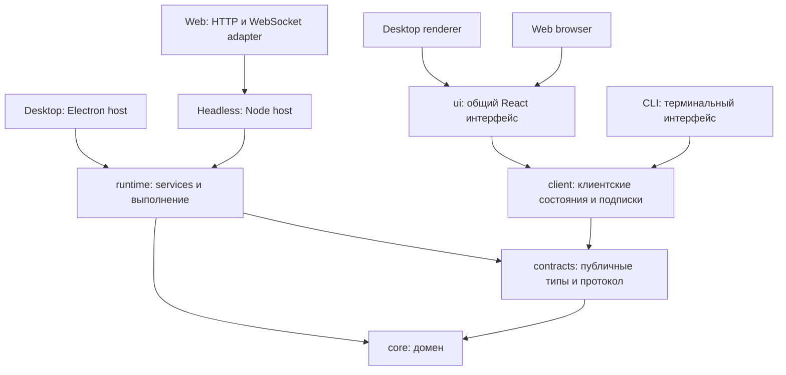

# Общий фундамент Orca для Desktop, CLI и Web

Дата: 02.10.2026. Исследованная база: `origin/develop`, `b3433f4`, Desktop `1.1.2`.
Статус: архитектура утверждена пользователем 02.10.2026; реализация ещё не начата.

## 1. Требования и границы

Пользователь согласовал один монорепозиторий с общим фундаментом и тремя отдельными
продуктами: Desktop, CLI и Web. Общими должны быть доменная модель, правила,
инструменты, выполнение, управление агентами и всё, что не обусловлено конкретной
платформой. Каждый продукт развивается и выпускается независимо, со своей версией.

Сначала перестраиваем фундамент и переводим существующий Desktop на него.
После проверки базы создаём Web для собственного арендованного сервера; CLI как
отдельный терминальный продукт делаем позднее. Очерёдность не разрешает отложить
архитектурные требования CLI: процессы должны жить без интерфейса, SSH может
оборваться, клиенты разных версий могут подключаться к одному owner.

Первая Web-версия — закрытая панель для одного или двух доверенных пользователей.
Проекты, Git, файлы, агентские инструменты и процессы находятся на сервере;
браузер управляет ими по HTTPS. Общий сервер не означает изоляцию пользователей
друг от друга. Публичный сервис, несколько организаций, биллинг, квоты и запуск
недоверенных проектов в изолированных средах — отдельный будущий проект.

Текущая задача охватывает архитектуру и последовательность подготовки базы.
Реализацию Web, терминального интерфейса и развёртывание сервера оформляем
следующими проектами после критериев готовности из раздела 12.

## 2. Исходное состояние и контекст CLI

Уже есть pnpm-монорепозиторий: Electron Desktop с React/TypeScript/Vite,
browser-safe `packages/core`, служебный JS-клиент `packages/cli`, встроенные skills.
Основные зависимости выполнения — Node.js, `node-pty`, Git и установленные CLI
провайдеров. UI терминала использует xterm; Markdown проходит существующий санитайзер.

Core содержит модель, store, миграции и правила переходов, но реальные действия
остаются в `apps/desktop/src/main`: проекты, persistence, Git, workflow executor,
PTY, worker/coordinator и ассистент. `main/index.ts` связывает их с Electron,
IPC, сокетом и lifecycle. Renderer обращается к `window.orca`; общей модели
сейчас недостаточно для запуска программы без Electron.

Предыдущий проект CLI сохранён в [PR #55](https://github.com/NANDIorg/BigOrcaCocks/pull/55),
коммит `1355c1c`:

- [контекст](https://github.com/NANDIorg/BigOrcaCocks/blob/1355c1c/docs/superpowers/specs/2026-10-02-orca-cli-handoff.md);
- [архитектура CLI](https://github.com/NANDIorg/BigOrcaCocks/blob/1355c1c/docs/superpowers/specs/2026-10-02-orca-cli-design.md);
- [план CLI](https://github.com/NANDIorg/BigOrcaCocks/blob/1355c1c/docs/superpowers/plans/2026-10-02-orca-cli.md).

Оттуда сохраняем терминальный чат как основной сценарий, общие services,
headless owner, отдельный observer, сохранённые диалоги и проверку Node/Electron ABI.
Его карта файлов основана на более старом `6275e1d`: переносы сверяются с текущим
кодом, включая произвольные вложения, запуск агентов и настройки permissions.
Этот документ добавляет Web, общий UI и независимые релизы. Старый план CLI
нельзя исполнять целиком параллельно с извлечением тех же модулей.

## 3. Выбранный подход

Извлекаем существующую реализацию в общие пакеты и оставляем приложения тонкими
host/client-оболочками. Desktop продолжает работать на каждом этапе; перенос
кода сопровождается переносом его тестов и сохранением поведения.

Копия Desktop для Web удвоила бы правила и исправления. Отдельный репозиторий
потребовал бы заранее публиковать и синхронизировать внутренние библиотеки.
Монорепозиторий позволяет менять контракт вместе с потребителями, проверять их
одним CI и при этом выпускать каждый продукт отдельно.

Целевая структура:

```text
packages/
  core/          чистая доменная модель, store, миграции и переходы
  contracts/     DTO, схемы запросов/ответов, ошибки, события, capabilities
  runtime/       Node: services, persistence, Git, agents, sessions, dialogs
  client/        общий клиент: запросы, подписки, reconnect, состояния диалога
  ui/            React UI Desktop/Web, стили, i18n и логика представления
  cli/           самостоятельный терминальный продукт + старый agent client
apps/
  desktop/       Electron host, IPC/preload, platform adapter, упаковка
  headless/      Node host: ownership, lifecycle, локальный endpoint, service mode
  web/           браузерный entrypoint, HTTP/WS adapter и серверная упаковка
skills/          единый источник инструкций ассистента/координатора/воркера
```

`apps/headless` — внутренний host, включаемый в CLI и серверную поставку Web,
а не четвёртый обязательный публичный продукт. Два приложения не запускают
два владельца одного профиля: CLI на Web-сервере подключается к существующему owner.
Не создаём параллельный `apps/server` с собственной реализацией runtime.
Повторно используемый bootstrap host экспортируется отдельно от исполняемого
entrypoint: импорт Web/CLI не запускает daemon как побочный эффект.

Направление зависимостей:



Contracts может переиспользовать browser-safe типы core, но не экспортирует
клиентам изменяемый store. Core не зависит от runtime/contracts/UI. Runtime
не импортирует desktop/headless/web. Contracts, client и UI не импортируют
Node/Electron; Node-адаптер локального соединения находится в host/CLI.
Границы проверяются импортами и сборками, а не только соглашением о папках.

## 4. Общие services и транспортные адаптеры

Единственная точка выполнения действий — application services runtime:
проекты и группы; доска и глобальные задачи; роли, типы и workflow; запуск,
остановка и review/merge; диалоги; файлы/вложения/документы; статистика и настройки.
Каждый service выполняет валидацию, доменные guards, persistence и effects.
TypeScript DTO дополняются проверкой входных данных во время исполнения:
сетевой или агентский запрос нельзя считать валидным по типу в исходниках.

IPC, локальный operator endpoint, существующий agent socket и будущий HTTP/WS
вызывают одни services. Разница в авторизации, сериализации и доставке событий.
Клиент не открывает JSON store и не повторяет backend guards. Обещание ассистента
в тексте не считается успешным действием без результата runtime/tool.

Выделяем общий `OrcaClient` с типизированными методами. Текущий `OrcaApi` содержит
также window/dialog/update-функции: они уходят в `PlatformAdapter`, а не в API
управления сервером. Прежний `window.orca` временно остаётся совместимым адаптером
при поэтапном переносе renderer. Поддержка старого preload при HMR сохраняется.

Запрос имеет явный `projectId`, идентификатор клиента и контекст действующего
лица, установленный host. Выбранный проект, вкладка и размеры терминала — состояние
конкретного клиента; общий `ProjectManager.activeId` не определяет проект чужого
запроса. Реальные настройки проекта остаются общими и сохраняются с revision.
Язык интерфейса также принадлежит клиенту: общие коды ошибок переводятся его i18n.
Язык инструкций агентам задаётся явной настройкой profile/проекта, а не последней
открытой вкладкой другого оператора.

Основной набор contracts включает handshake, project/task/workflow DTO,
dialog/session/file DTO, notification/event envelope, ошибки с `code/details`,
revision и capabilities. Собственный текущий JSONL RPC не объявляем стандартным
JSON-RPC 2.0. Legacy agent client сохраняет envelope, команды, HELP и exit codes;
новые поля добавляются совместимо. Не выдаём запланированные команды за существующие.

## 5. Runtime, ownership и lifecycle

`createOrcaRuntime(options)` получает явные зависимости: канонический dataDir,
endpoint, пути bundled skills/agent client, Node executable, session host,
logger, язык, product/runtime metadata и adapters необходимых эффектов.
Runtime не определяет пути через `app.getPath`, `process.resourcesPath` или окно.

Desktop сначала встраивает этот runtime локально, сохраняя текущий userData.
Headless запускает тот же runtime под Node без Electron и DISPLAY. Его default
profile — `~/.orca-board/profiles/default`; короткий локальный endpoint располагается
в `~/.orca-board/run/`, с платформенными named pipes на Windows. Другие профили
выбираются явно. Подключение Desktop к удалённому owner — последующий сценарий,
не условие завершения первого переноса.

У одного канонического dataDir только один owner. Ownership приобретается до
backup, миграций и создания TaskStore: загрузка store уже меняет состояние старых
dispatch. Клиент сперва проверяет endpoint/handshake и подключается к owner;
короткие запросы не создают свои экземпляры runtime.

Lock содержит instance identity и служит основанием для проверки владельца.
Один PID не доказывает ownership; учитываются canonical path, handshake и nonce.
Живой чужой socket не удаляется. Удаление подтверждённого stale endpoint,
восстановление lock и конкурентный startup проверяются отдельными сценариями.

Закрытие вкладки, терминального чата или SSH-соединения отсоединяет клиента.
Процессы агентов и диалоги принадлежат owner и продолжают работу. Restart owner
в первом выпуске прерывает его PTY; store/worktree сохраняются, старые dispatch
проходят существующее восстановление в unknown/ready с явным restart/reconciliation.
Живое сохранение процессов между рестартами потребовало бы отдельного supervisor
и не обещается этим переносом. Остановка клиента и остановка owner — разные действия.

## 6. Процессы, диалоги и события

### PTY и запуск агентов

Общий SessionRegistry хранит lifecycle, input/resize, output/exit subscriptions,
ограниченный tail и `isAlive`. PTY factory внедряется host; подписка не зависит от
BrowserWindow. Worker/coordinator сначала сохраняют существующий PTY backend.
Codex app-server, Claude stream-json и ACP ассистента переиспользуются; замена
провайдеров и перевод всех workers на structured drivers не входят в извлечение.

На PTY допускается один writer lease для ввода и resize, с явной передачей и
освобождением при disconnect/expiry. Остальные подключения наблюдают. Просмотр
не меняет активность задачи. Журнал ротируется и ограничивается по объёму;
ANSI raw tail — replay, а не гарантия точного восстановления экрана любого TUI.

### Диалоговый service

Вместо singleton ассистента — registry диалогов. У каждого dialog свои проект,
provider binding, conversation id, сообщения, ожидающие запросы и состояние turn.
Общие методы создания/выбора, отправки/отмены, ответа, получения transcript и
подписки используются Desktop, Web и CLI. Новые клиенты не содержат свой цикл LLM.

`clientMessageId` обеспечивает идемпотентную отправку после reconnect. Revision
защищает редактирование от устаревшего состояния. Поздний callback/ответ проверяется
по dialog/session/request/turn; его нельзя применить к следующему диалогу.
Provider permission/question, подтверждение мутации Orca и HumanRequest результата
имеют отдельные типы, ids и правила разрешения. Два клиента не отвечают на один
запрос дважды; runtime возвращает уже принятый ответ или конфликт revision.

Сохраняются transcript и provider binding. Resume используется, когда его
поддерживает конкретный transport; текущий `thread/start` сам по себе не является
resume. При невозможности возобновления интерфейс явно предлагает новый диалог.
Сохранённые tool calls не выполняются повторно при чтении истории.

### Потоки и восстановление

Потребление координатором через существующий `check` и `consumedBy` сохраняется.
Клиентский observer получает независимый cursor и ничего не потребляет за агента.
Snapshot и подключение к потоку имеют общий revision/cursor barrier: событие между
ними не теряется. Replay ограничен; при слишком старом cursor возвращается требование
полного snapshot. Backpressure и лимиты не позволяют медленному клиенту удерживать
неограниченную очередь в памяти owner.

Client содержит общий reconnect/backoff и применение snapshot/event state;
транспорт доставляет данные. После reconnect повторяются безопасные чтения,
а мутации восстанавливаются по request/message identity. Повторная доставка события
не вызывает повторный запуск процесса. Событийный payload остаётся ограниченным,
полные ответы читаются отдельно, как в текущем контракте.

Для мутаций фиксируются scope идентификатора и результат принятого запроса;
повтор с тем же id и другим payload отвергается. Срок хранения dedup и replay
согласуется с поддерживаемым окном reconnect. После рестарта незавершённый внешний
effect имеет неопределённый результат до reconciliation, а не автоматически
повторяется под видом безопасного retry.

## 7. Git, persistence и перенос проектов

Сохраняем JSON, атомарную запись, backups и существующие миграции. Перенос пакетов
не должен сам менять формат пользовательских данных. Новые поля версионируются;
неподдерживаемая версия схемы отвергается до записей с инструкцией восстановления.
SQLite, новый scheduler и смена модели workflow — отдельные проекты.

Git вызывается аргументами через process API без shell. Текущие синхронные операции
изолируются общим Git service и переводятся на async до готовности серверной базы:
длинная Git-команда не должна блокировать API/PTY/heartbeat всего owner.
Конкурирующие мутации сериализуются по каноническому Git commonDir, поскольку разные
worktree могут принадлежать одному репозиторию. Независимые репозитории работают
параллельно. Очередь не удерживается во время ожидания человека или событий агента.

После await проверяется актуальность EffectToken: run/node/visit/lane/dispatch.
Если этап уже отменён или сменился, запоздалый результат не меняет новый этап.
Внешние effects допускают reconciliation; exactly-once для Git и процессов не
обещается. Очередь/идемпотентность запросов не заменяет проверку актуального run.

Проекты и вложения сейчас содержат абсолютные локальные пути, а id проекта зависит
от корневого пути. Поэтому перенос на сервер — отдельная управляемая offline-процедура:
остановка owner, backup, перенос репозиториев с непушенными ветками и worktree,
переназначение путей/ссылок/id там, где требуется, проверка данных и запуск одного owner.
Копирование только JSON недостаточно. Входной набор сохраняется до успешной проверки;
автоматическая миграция данных на ещё не выбранный сервер сейчас не запускается.

## 8. Общий UI и платформенные отличия

В `packages/ui` извлекается нынешний React-интерфейс: доска, задачи, workflow,
чат, терминалы, файлы, документы, статистика, настройки проекта, стили и ru/en i18n.
Бизнес-правила и сессии остаются в runtime; UI содержит представление и состояние
пользовательского взаимодействия. CLI использует общие client/contracts, но
рисует терминальный интерфейс отдельно и не получает зависимость от React.

Корневое приложение UI получает `OrcaClient` и `PlatformAdapter` с capabilities.
Desktop adapter отвечает за окно/меню/tray, системные диалоги, OS notifications,
открытие внешнего URL и обновление приложения. Web adapter отвечает за браузерные
загрузку/скачивание, навигацию, доступные notifications и reconnect. Наличие
возможности проверяется до показа/выполнения действия, с понятным доступным вариантом.

Выбор серверного проекта не использует локальный file picker браузера. Файлы
на сервере выбираются через разрешённый серверный root; локальные вложения загружаются.
Размеры окна и раскладка панели сохраняются отдельно для клиента. Общий UI не
загрязняется проверками Electron в каждом компоненте; отличия задаёт adapter.

Массовый перенос UI начинается после стабилизации contracts/runtime, с совместимым
bridge к текущему preload. Компоненты не переписываются ради новой структуры.
Изменение визуального дизайна не входит в подготовку фундамента.

## 9. Web и CLI: предусмотренные границы

### Закрытый Web на собственном сервере

HTTP/WebSocket adapter применяется к тому же headless runtime. До публичной
доступности обязательны HTTPS, аутентификация одного/двух операторов, проверка
Origin/CSRF для cookie-авторизации и WS, лимиты запросов/потоков/загрузок и проверка
полномочий на сервере. Browser `actor.kind` не является доказательством личности;
principal устанавливает adapter после проверки сессии. Агентские credentials
находятся на сервере и не отправляются клиенту.

Механизм входа и адрес/провайдер сервера выбираются в проекте развёртывания Web.
Для общей базы нужны verified principal и capabilities, а не таблицы организаций.
Operator endpoint и старый agent socket разделены. Agent scope ограничивает
доступные методы и чувствительные настройки запуска. Локальный socket не публикуется
в Интернет; процессы одного OS-пользователя не считаются взаимно изолированными.

Файлы выдаются по opaque id/разрешённому относительному пути; backend проверяет
root, realpath и symlink, права и размер. Contracts не требуют локального `file://`
или абсолютного пути в браузере. Upload/download — отдельный бинарный маршрут,
а не огромный base64 в RPC/event. Preview сохраняет whitelist/token scope,
CSP/sandbox и сетевую политику нынешнего `orca-preview`; браузерный HTML preview
идёт с отдельного origin без доступа к cookies панели. Это обязательное условие
Web, не повод временно открыть произвольную файловую систему.

TLS/reverse proxy, persistent data volume, service manager, backup/restore и
graceful stop относятся к поставке Web. Systemd/service lifecycle должен поддерживать
явные profile/log paths без терминала; установка сервиса пока не выполняется.
Обновление сервера планирует остановку процессов и проверку схемы; отсоединение
браузера этого не делает. Старые вкладки проверяют handshake и требуют reload
при несовместимом API вместо отправки неверных мутаций.

### Самостоятельный CLI позднее

Планируемый основной entrypoint `orca` — интерактивный чат по SSH, с явными командами
как дополнением. Это описание будущего продукта, не существующей команды.
CLI подключается к operator endpoint выбранного profile, запускает owner только
при его отсутствии и не подменяет уже работающий Web owner своей новой версией.
Отдельная обязательная установка Electron или headless-пакета не требуется.

Публичная CLI-поставка включает собранный client/headless/runtime, skills, совместимый
agent client и необходимые native dependencies. Имя npm-пакета и права публикации
проверяются при подготовке CLI, а не являются условием извлечения runtime.
Linux без GUI и fallback доступной shell предусмотрены сейчас; пути и delimiter
не привязываются к macOS. Amp/shell сохраняют терминальный режим, где нет structured
chat transport. Возможности выводятся из handshake, а не предполагаются по версии.

Существующий `packages/cli/bin/orca-board.js` сохраняется dependency-free: Desktop
копирует его в Resources и запускает без node_modules. Будущий чат собирается
отдельным entrypoint в том же CLI-проекте; запрет импортов core/npm в старый файл
не отменяется. Обязательное дублирование его path helper сохраняется до отдельного
совместимого изменения поставки. Skills и HELP не расходятся с реальными командами.

## 10. Независимые версии и релизы

Версия продукта и совместимость соединения — разные понятия. Desktop, CLI и Web
имеют независимые SemVer в своих package manifests; внутренние пакеты private
и встраиваются в каждую поставку из её проверенного commit. Изменение runtime
не требует одновременно выпускать три продукта. Уже установленный Desktop
продолжает использовать собственную проверенную копию runtime.

Handshake включает `protocolMajor`, capabilities, runtime revision, schema version
и product version. Точное совпадение product versions не требуется. Несовместимый
protocolMajor отвергается до мутаций; отсутствие отдельной capability даёт понятный
ответ и отключение соответствующего действия. Формат хранения проверяет owner,
клиенты не выполняют миграции. Core/runtime не становятся четвёртой публичной
версионной линейкой, которую пользователь обязан устанавливать отдельно.

Схема выпуска с сохранением существующего Desktop:

| Продукт | Версия | Тег | Ветка подготовки | Поставка |
| --- | --- | --- | --- | --- |
| Desktop | `apps/desktop/package.json` | `vX.Y.Z` | `release/X.Y.Z`, `hotfix/X.Y.Z` | существующие подписанные установщики и update manifests |
| CLI | `packages/cli/package.json` | `cli/vX.Y.Z` | `release/cli/X.Y.Z`, `hotfix/cli/X.Y.Z` | самостоятельный CLI-пакет |
| Web | `apps/web/package.json` | `web/vX.Y.Z` | `release/web/X.Y.Z`, `hotfix/web/X.Y.Z` | согласованная браузерная и серверная сборка |

CLI/Web строки — целевая политика, текущие guards ещё её не поддерживают.
Root package перестаёт быть источником версии всех продуктов; его нынешняя
`1.1.2` не меняется в этой задаче. Выравнивание root/Desktop сохраняется до
совместимого изменения release tooling. Номера будущих первых CLI/Web выпусков
назначаются только в соответствующих релизных поручениях.

Desktop сейчас читает GitHub `releases/latest` и `latest-mac.yml`/`latest.yml`.
До отдельного изменения update feed только Desktop может становиться GitHub Latest;
CLI/Web выпускаются с `make_latest=false`. Их workflows не записывают Desktop
manifests. Существующие `v*` и файлы опубликованных выпусков не меняются.
Параметр управления Latest задан в [GitHub Releases API](https://docs.github.com/en/rest/releases/releases#create-a-release);
его применение проверяется release fixtures и сценариями всех текущих updater backends.
Морские кодовые имена и их additive-реестр сохраняют Desktop-серию; CLI/Web
используют названия продукта и версию без переназначения существующих имён.

В фундамент входит адаптация `check-git-flow`, release/codename guards, их тестов,
ruleset-конфигураций и документации под product-aware политику. Desktop release
workflow продолжает действовать; CLI/Web workflow добавляются с поставками продуктов.
Настройки удалённых protected branches/rulesets меняются только когда есть
конкретная проверенная конфигурация и полномочие применить её. Никакие публикации,
теги, сертификаты или secrets в рамках подготовки базы не создаются.

Feature → develop и интеграционная проверка остаются общими. PR подготовки выпуска
обновляет только выбранный продукт; merge в master содержит проверенный снимок
монорепозитория, но не выпускает автоматически остальные приложения. Выпущенный
артефакт привязан к commit/tag своей линейки. Backmerge сохраняет чужие версии.
Release concurrency и правило одной активной подготовки действуют на продукт,
чтобы независимые линейки не блокировали друг друга.

## 11. Этапы подготовки и карта переносов

Это порядок архитектурных рубежей; проверяемые задачи и точные commits будут
составлены после проверки этого документа. Не выполняем один массовый перенос.

| Этап | Основной перенос | Условие перехода |
| --- | --- | --- |
| 1. Контракты и границы | общие части `shared/ipc.ts`, assistant/file/workflow DTO; client interface и platform boundary | Desktop совместим с прежним preload; browser-safe сборки и import guards |
| 2. Runtime без Electron | projects/persistence/backup/Git, services и wiring из `main/index.ts` | Desktop использует общие services; те же guards и effects |
| 3. Исполнение и сессии | `pty.ts`, `worker.ts`, agents/launch, workflow/review/run modules, prompts | headless tests запускают PTY без окна; detach не останавливает worker |
| 4. Диалоги и observers | assistant/conversation/session, transcripts, request/revision/idempotency, event replay | изолированные диалоги и проекты, ответы после reconnect, нет потери событий |
| 5. Headless и надёжность | owner/lock/endpoints/service lifecycle; async Git queues/effect tokens | один writer данных, независимые клиенты, restart/reconciliation и responsive API |
| 6. Файлы и полный service API | attachments/project-files/docs/rules/stats/groups/types/workflow drafts | интерфейсы не обходят services; серверные пути и доступ проверяются |
| 7. Общий UI | renderer React, стили/i18n; `window.orca` через client/platform adapters | Desktop собран и рабочий; UI собирается для браузера без Electron/Node |
| 8. Поставка и релизные границы | Node/Electron native roots, headless artifact smoke, product-aware release tooling | Linux host без DISPLAY; нынешние Desktop build/update и независимые версии проверены |

`about-window`, app-menu, window-chrome, tray, native dialogs и updater остаются
Desktop-специфичными. Общие DTO appearance/theme/notifications переезжают, оконные
DTO — остаются у platform adapter. Preview policy и file service общие, Electron
protocol registration — Desktop adapter, HTTP preview — будущий Web adapter.

Тесты переносятся вместе с ответственным модулем. Globs каждого пакета явно
включают новое расположение; «тест лежит в папке» не означает, что он запускается.
На текущей базе уже есть рабочие механизмы workflow, backups, permissions и
вложений: сохраняем их, а не восстанавливаем старые версии из CLI-плана.

## 12. Проверка готовности базы

Общий фундамент готов, когда выполнены все условия:

1. Desktop сохраняет существующий цикл: проект → задача/workflow → agent → вопрос
   человеку → результат/review/merge; актуальная локальная сборка запускается.
2. Runtime/headless не импортируют Electron/Desktop. Общий UI/client/contracts
   собираются без Node; browser import graph проверяется автоматически.
3. Headless работает под Node 24 на Linux без DISPLAY, с реальным PTY spawn,
   Git и доступным тестовым process driver; создание настоящего платного LLM-сеанса
   не требуется для автоматической проверки. Установленный артефакт проверяется
   вне workspace и не зависит от его node_modules/TS-source.
4. Два startup одного profile дают одного owner; foreign live endpoint остаётся
   нетронутым. Backup/load/migrations не выполняются вторым клиентом.
5. Два клиента имеют отдельные selected project/dialog. Disconnect не останавливает
   worker; повторный send не удваивает запрос. Поздние ответы не меняют новый turn.
6. Observer не потребляет `check`-события. Snapshot/replay имеют barrier,
   просроченный cursor требует snapshot, очереди и журналы ограничены.
7. Git не блокирует обслуживание owner; мутации общего repo сериализуются,
   устаревший effect проверяется после await. Сохраняются существующие guards.
8. Данные Desktop открываются без незапрошенной миграции путей; restart сохраняет
   задачи/worktree и честно показывает прерванные PTY. Backup/restore проверен.
9. Agent client и встроенные skills совместимы. Операторские методы и секретные
   настройки не становятся автоматически доступны агенту или browser actor.
10. Версии/теги продуктов не обязаны совпадать; CLI/Web release fixtures не меняют
    Desktop Latest/feed/codenames. Несовместимый protocol/schema блокирует запись.

Node и Electron используют разные native ABI. Проверки запускаются в раздельных
install/build roots, включая реальный installed Linux smoke; последовательный
rebuild одного физически общего `node-pty` в pnpm store не доказывает совместимость
двух поставок. Поддержка Windows/macOS сохраняется существующим CI.

Проверки на этапе: целевые tests, typecheck и необходимая сборка; перед PR —
`pnpm verify`. Документация/skills требуют core tests с проверкой CLI HELP.
После завершённого пользовательского этапа собирается и открывается локальный
Desktop по AGENTS.md; ручную проверку UI выполняет пользователь.

## 13. Размер работы, риски и откат

Это крупное извлечение backend и среднее изменение границ renderer. Основной объём
составляют services/lifecycle/contracts и проверка поведения при параллельных
клиентах; перенос файлов сам по себе задачу не решает. Core и большая часть React
компонентов переиспользуются. Оценка по срокам появляется после декомпозиции этапов
и проверки первого переноса, а не как точное обещание по числу папок.

Сначала в репозитории станет больше явных интерфейсов и host-adapters. Повторная
реализация правил не добавляется; нынешний монолитный wiring уменьшается. Специальные
оболочки нужны там, где отличаются процессы, транспорт и OS/browser возможности.
Извлечение не должно вынуждать выпускать Web/CLI или менять пользовательский UI.

Каждый рубеж — небольшой проверяемый PR, с сохраняющимся Desktop. При проблеме
откатывается конкретный PR или переключается ещё сохранённый compatibility adapter;
история/чужие worktree не переписываются. Новый формат данных вводится отдельно с
backup и миграционными tests; старый executable не запускается на неподдерживаемой
новой схеме. Публикация продукта — самостоятельное поручение.

Следующий результат после утверждения архитектуры — подробный план первого этапа
извлечения contracts/services с проверками и безопасными границами коммитов.
Создание новых Web/CLI интерфейсов начинается после готовности общей базы.

Первый конкретный перенос описан в [плане общих контрактов](../plans/2026-10-02-orca-shared-contracts.md).
Он отделяет общие DTO/чистые функции и локальный Desktop API; service API и runtime
идут следующими переносами согласно указанным рубежам.
