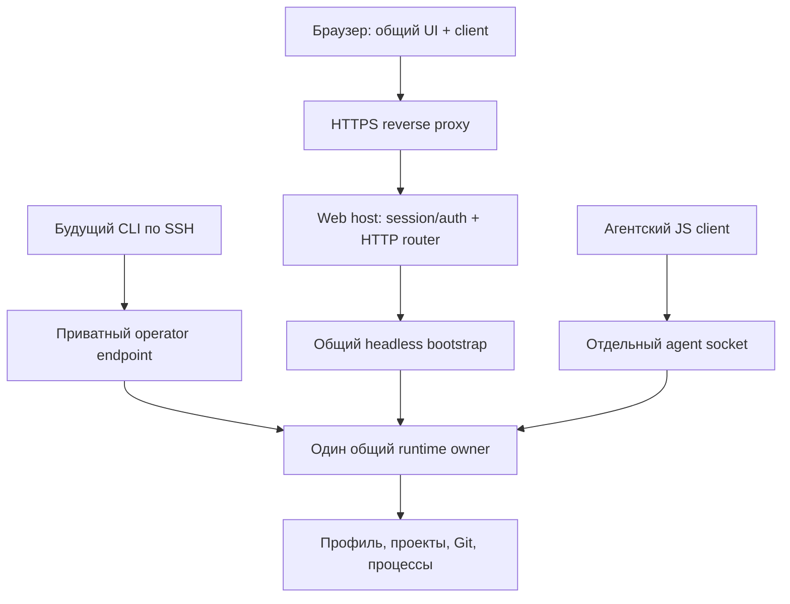

# Устанавливаемая Web-версия Orca

Дата: 04.10.2026. База: `origin/develop`, `57f6d1b`, после Desktop 2.0.0.
Статус: предложение для проверки пользователем; Web ещё не реализован.

## 1. Согласованный результат

Пользователь хочет управлять проектами и агентами сервера через привычный интерфейс
Orca в браузере. Web должен быть самостоятельным продуктом: любой владелец своего
сервера устанавливает готовую поставку и задаёт несколько настроек. Общие runtime,
contracts, client и UI используются из монорепозитория. Выпуски Web независимы
от Desktop и будущего терминального CLI.

Подтверждено в этой сессии:

- Сервера пока нет. Разработка и проверка сначала локальные, целевое развёртывание — Linux.
- Первый способ установки — обычный Linux-сервис с установщиком.
- Агенты работают прямо на сервере под обычным Unix-пользователем и используют
  установленные для него инструменты и доступные ему проекты.
- Docker может появиться как дополнительная поставка позднее.

Первая установка рассчитана на одного-двух доверенных операторов с одинаковым
доступом к общему профилю. У разных установок независимые данные, credentials и
процессы. Регистрация в общем сервисе, организации и биллинг остаются будущими задачами.
Права процессов определяются выбранным Unix-пользователем; серверная панель не
создаёт изоляцию запускаемого кода разных операторов.

## 2. Уже готовая база и границы нового проекта

Все этапы A–F [общего фундамента](../../orca-foundation-progress.md) завершены.
[Handoff](../../orca-development-handoff.md) сохраняет предыдущие решения.
Backend повторно не извлекается и не переписывается.

Проверенные точки подключения:

- `apps/headless/src/index.ts`: `startHeadless()` загружает installed resources,
  Node-native PTY, один profile owner, runtime и отдельный приватный operator endpoint.
- `packages/runtime/src/orca-runtime.ts`: общий bootstrap принимает product metadata,
  host authorization, окружение и preview address.
- `packages/runtime/src/operator-endpoint.ts`: HTTP handler уже поддерживает
  проверенный host principal, handshake, commands, snapshots/events, binary и writer.
  Сейчас handler связан с loopback listener; его нужно переиспользовать в Web router.
- `packages/client/src/http.ts`: browser-safe transport использует cookie credentials.
- `packages/ui/src/mount.tsx`: общий интерфейс получает injected client/platform.
  Desktop сохраняет compatibility API; общий typed adapter нужен для остальных методов.

Новые продуктовые части: `apps/web`, Web authentication/configuration, browser platform,
server directory picker, HTTP preview adapter и установочная поставка. Общий adapter
typed commands → UI compatibility API принадлежит `packages/client`.

## 3. Выбранная поставка

Основной вариант — готовый Linux-пакет с браузерной сборкой, серверной сборкой,
совместимым Node.js 24, Node-native dependencies, skills и агентским JS client.
Пользователю не нужны исходники, pnpm, Electron или сборка проекта на сервере.
Node и native module поставляются для одной согласованной архитектуры/ABI.

Первый проверяемый target — Linux x64, Ubuntu 24.04 с systemd. Другие дистрибутивы
и arm64 получают свои установочные проверки прежде, чем объявляются поддерживаемыми.
Разработка Web host на macOS допустима; macOS не является первым серверным target.

Альтернативы рассмотрены:

| Вариант | Применение |
| --- | --- |
| Готовый Linux-пакет + systemd | Выбран: процессы используют серверные инструменты и проекты выбранного пользователя |
| Docker Compose | Позднее: потребуется явное подключение проектов, toolchain и agent credentials контейнера |
| Clone + сборка исходников | Только разработка; не основной путь установки владельца сервера |

Номер первого Web-релиза назначается отдельным релизным поручением. Новый private
manifest при разработке получает `0.0.0`; root/Desktop остаются 2.0.0.

## 4. Установка и первые настройки

Установщик проверяет ОС/архитектуру, комплект и контрольные суммы, предлагает
Unix-пользователя сервиса и размещает приложение отдельно от постоянных данных.
Повторная установка не перезаписывает существующий профиль и настройки молча.

Мастер запрашивает:

1. Логин и пароль первого оператора.
2. Каталог или каталоги серверных проектов.
3. Домен панели, если сервер уже доступен по домену.

Без домена доступен только локальный режим. Порты, data/config paths, preview hostname
и размещение сборки имеют согласованные значения по умолчанию; их можно изменить
в расширенной настройке. Второго доверенного оператора добавляет владелец локально
через административный entrypoint поставки.

Значения по умолчанию: панель `http://localhost:3737`, preview
`http://127.0.0.1:3738`, оба listener на `127.0.0.1`. В installed Linux режиме
config/accounts находятся в `~/.config/orca-web`, профиль —
`~/.orca-board/profiles/default`, версии приложения — в
`~/.local/share/orca-web/releases`. Все пути вычисляются для пользователя сервиса.
Для локальной разработки/тестов передаётся отдельный disposable dataDir, а не
существующий Desktop или установленный пользовательский профиль.

На сервере отдельно требуются Git и выбранные CLI-агенты с их обычной авторизацией
для пользователя сервиса. Установщик показывает, что обнаружено и чего не хватает.
Пароли/токены агента не вводятся в браузер Orca и не переносятся с Desktop автоматически.
Настройка реального LLM-провайдера может требовать действия пользователя в его CLI.

Системные зависимости и установка сервиса требуют обычных прав администратора
сервера. Рабочий процесс Orca и агенты запускаются под выбранным непривилегированным
пользователем; его Git identity, SSH-доступ и toolchain сохраняются.

## 5. Один owner, два интерфейса доступа

Web host использует bootstrap `apps/headless`, задавая product metadata и проверенные
host ports. Native/resource wiring не копируется в новый daemon. Минимальные
расширения bootstrap и повторно используемого HTTP handler сохраняют существующий
`startHeadless()` и его installed artifact.

Приватный operator endpoint и credential-файл остаются локальными для будущего CLI.
Web router вызывает тот же operator handler с browser authentication; приватный
bearer token не выдаётся браузеру. Agent socket не становится внешним HTTP endpoint.

При startup сначала приобретается profile ownership и проверяется схема, затем
открываются рабочие HTTP входы. При неудаче частично открытые входы и native resources
закрываются. Сигналы остановки закрывают ingress, observers/writers и native процессы
до освобождения owner. Закрытие вкладки отсоединяет её client, процессы продолжаются.

## 6. Вход и сетевые границы

Вход — логин/пароль с непрозрачной серверной сессией. Пароли хранятся как hashes с
случайной солью; используется асинхронный `node:crypto.scrypt`, без собственной
криптографии ([Node.js 24](https://nodejs.org/docs/latest-v24.x/api/crypto.html#cryptoscryptpassword-salt-keylen-options-callback)).
Файл аккаунтов имеет ограниченные права. Login body ограничен,
проверки пароля имеют ограниченную параллельность и защиту от частых попыток.

Первый формат hash record хранит salt и параметры scrypt: N=32768, r=8, p=1,
key length 64 bytes, maxmem 64 MiB; salt — 16 случайных bytes. Password input
от 12 символов до 256 bytes UTF-8, без изменения введённой строки.
Одновременно вычисляются не более двух password hashes. Auth/session storage
отделён от profile store; его schema version проверяется при загрузке config.

Сессия ограничена по сроку жизни и idle time; registry имеет ограниченный размер.
Cookie host-only, HttpOnly, SameSite=Strict, Path=/; в HTTPS-режиме используется
Secure и имя с `__Host-`. В локальном HTTP-режиме отдельное имя cookie и только
loopback bind. Restart Web host завершает browser sessions и требует нового входа.
Это не меняет durable mutation ledger и сохранённую историю диалогов.

Начальные лимиты: TTL сессии 12 часов, idle 30 минут, до 64 sessions; login body
до 16 KiB, до 5 неуспешных попыток в минуту по bounded limiter. RPC сохраняет
нынешний лимит 64 KiB, binary — существующие attachment limits. Числа конфигурации
валидируются; выключение лимита через отрицательное значение не допускается.

Все operator routes, uploads, downloads и streams требуют session authentication.
Principal создаёт host из записи аккаунта; браузер не выбирает actor. Tab identity
привязана к authenticated session и operator identity, поэтому чужой client label
не даёт доступа к чужому writer или request namespace.

Для browser mutations обязательны точный разрешённый Origin и session CSRF token.
Host validation и правила reverse proxy заданы конфигурацией; произвольные forwarded
headers не принимаются как доверенные. Login также проверяет Origin. CORS панели
не открывает credentialed доступ другим origin. WS при подключении проверяет те
же session/Origin и закрывается при expiry/logout.

Режим сервера требует HTTPS app origin. Node listeners остаются loopback; наружу
выходит reverse proxy. Поставка содержит согласованный пример
[Caddy](https://caddyserver.com/docs/automatic-https) с отдельными
доменами панели и preview. HTTPS включается после настройки DNS и доступности
порта сервера, а не обещается для ещё не существующего домена.

Статика выдаётся только из browser build directory. Profile/config, исходники,
operator credential, private socket и agent credentials не входят в static root.
Health/readiness дают ограниченный технический статус без данных проектов и secrets.

## 7. Общий интерфейс и состояние клиентов

`packages/client` получает общий adapter `OrcaClient → LegacyUiClient`, постепенно
переиспользуемый Desktop. Он переводит методы и события UI в существующие commands,
а не повторяет store, workflow, Git или правила запуска. Desktop compatibility/HMR
сохраняются. `apps/web` передаёт browser platform в общий `mountOrcaUi()`.

Project/dialog selection, язык интерфейса, вкладки и layout принадлежат клиенту.
Web adapter не меняет общий legacy activeId для выбора проекта другого оператора.
Shared settings и язык инструкций агентов меняются явной общей командой с revision.
Разные вкладки получают разные client identities; reconnect той же вкладки сохраняет
request identity в пределах действующей сессии.

Мутации передают явные project/dialog scope и revision. При конфликте перечитывается
состояние и показывается понятный результат. Неопределённый native effect не
повторяется автоматически. Несовместимый protocol/schema или устаревший bundle
требует перезагрузки до новых записей.

Существующий визуальный стиль, компоненты и ru/en сохраняются. Добавляются вход,
server directory picker и состояния подключения. Desktop menu/tray/updater и
оконные actions задаются capabilities; Web не показывает установщик Desktop
как обновление своей серверной версии. Недоступный метод даёт явное состояние,
а не ложный успешный ответ.

## 8. События, терминалы и reconnect

На первом этапе переиспользуются текущие HTTP snapshot/events; общий client уже
имеет cursor/reconnect. Потоки браузера подключаются к тем же bounded observers.
Для терминалов добавляется Web streaming adapter с backpressure и ограниченными
сообщениями; DOM/window не входят в SessionRegistry.

Вывод PTY идёт из owner, ввод/resize требуют текущий writer lease и sequence.
Renewal не заполняет durable ledger. Observer не потребляет coordinator check.
Disconnect/logout освобождает subscriptions и writer клиента, не вызывает kill
или stop runtime. После reconnect берётся replay либо snapshot при потерянном cursor.
PTY tail может быть ограничен; интерфейс честно показывает восстановление состояния.

При restart owner процессы первого выпуска прерываются. История/задачи остаются,
прерванные dispatch и native effects восстанавливаются существующими правилами
runtime. Живое продолжение LLM turn после перезапуска сервера не обещается.

## 9. Проекты, файлы и preview

Серверный picker показывает только настроенные roots и разрешённые каталоги.
Файловые проверки выполняются на сервере до обращения к общим project services:
canonical root, relative segments, realpath/symlink и права пользователя.
Прямой operator call не обходит ту же root policy. Browser-local file picker
используется для загрузки вложения, а не выбора серверного проекта.

Бинарные routes переиспользуют upload tickets, scope и ограничения runtime.
Вложения не передаются огромным base64 в RPC/events. Скачивание/открытие в браузере
заменяет Finder/Explorer. Небезопасные HTML/SVG документы не выдаются inline с
cookies панели; обычные downloads получают безопасные content headers.

HTML preview использует существующие snapshot/token, whitelist, range и CSP
из `packages/runtime/src/preview.ts`. Web задаёт HTTP PreviewAddress и adapter.
Preview размещается на другом hostname, без panel cookies и без авторизации
бинарным operator credential. Grant даёт только ограниченный snapshot.
В локальном режиме панель использует `localhost`, preview — `127.0.0.1` с другим
портом: один hostname с разными портами не изолирует cookies.

Сетевые restrictions, sandbox и проверка навигации сохраняются в пределах
возможностей браузера. До готовности защищённого Web preview соответствующие
capabilities выключены; произвольный file serving не используется как замена.

## 10. Сервис, обновление и данные

Поставка разделяет application releases, config/accounts и persistent data.
Рабочие проекты и agent credentials не лежат внутри заменяемого release directory.
Установка сервиса задаёт выбранного User, рабочие paths и PATH для bundled Node
и обнаруженных tools. Она не меняет глобальные настройки Git пользователя.

[Systemd unit](https://github.com/systemd/systemd/blob/main/man/systemd.service.xml)
запускает один основной процесс, поддерживает SIGTERM/graceful stop,
bounded restart policy, stop timeout и очистку оставшейся process group.
Выбирается `Type=exec`; [KillMode=mixed](https://github.com/systemd/systemd/blob/main/man/systemd.kill.xml)
даёт основному процессу graceful stop, затем manager очищает оставшиеся процессы
группы при превышении stop timeout. Значение timeout проверяется вместе с native shutdown.
Readiness проверяет фактический runtime/listener, а не только успешный exec Node.
Логи идут в journal без passwords, bearer/session/preview tokens и содержимого
credential-файлов. Поддержка systemd проверяется отдельно от macOS development.

Обновление — скачать конкретную Web-версию, проверить комплект, остановить owner,
сделать offline backup, переключить приложение и запустить readiness check.
Новая версия не подменяется под существующим тегом. Самовольной смены версии
сервером и скрытого рестарта активных агентов нет.

Rollback приложения допускается только при совместимой схеме. После изменения
схемы возвращается согласованный backup; проекты с непушенными ветками/worktrees
не откатываются молча. Удаление приложения не удаляет профиль и проекты.
Миграция живого Desktop profile на сервер остаётся отдельной offline-процедурой.

## 11. Последовательность реализации

Это общий проект Web; каждый рубеж получает небольшой конкретный implementation
plan и проверяемый результат. Завершённый общий фундамент не является рубежом Web.

| Рубеж | Результат | Критерий |
| --- | --- | --- |
| W1. Host и вход | `apps/web`, configuration/accounts/session, общий HTTP handler и headless bootstrap | Один owner; authenticated typed API локально; forged actor/Origin/CSRF отвергнуты; graceful stop |
| W2. UI и проекты | Общий typed UI adapter, browser entrypoint/platform, вход и server picker | Привычная панель читает/меняет серверный проект; две вкладки не меняют selection друг друга |
| W3. Потоки | Observer/reconnect, terminal output, writer leases | Disconnect не убивает PTY; stale/duplicate packets безопасны; очереди ограничены |
| W4. Файлы и preview | Binary routes, attachments, download и isolated preview origin | Root/symlink guards и preview restrictions сохранены; cookies панели не попадают в preview |
| W5. Установка | Installed Linux artifact с Node/native, wizard и systemd/reverse proxy templates | Чистая установка без workspace, перезапуск сервиса и сохранение данных; понятные prereqs |
| W6. Обновление и приёмка | Backup/update/rollback, документация и отдельный Web build workflow | Два клиента, installed artifact, CI и ручная browser-проверка; Desktop feed/версии сохранены |

Первым подробно планируется W1. Он включает только configuration/authentication,
reuse host/HTTP handler, backend entrypoint и интеграционные проверки. Общий React
интерфейс и установка systemd на настоящую машину начинаются в следующих рубежах.
После W1 нельзя объявлять Web готовым сайтом или публично развёрнутой программой.

Файлы первого рубежа:

- `apps/web/package.json`, server tsconfig и build entrypoint: отдельный workspace product.
- `apps/web/src/server/config.ts`, `accounts.ts`, `sessions.ts`, `http.ts`, `index.ts`:
  configuration, authentication, origin/CSRF и lifecycle.
- `apps/headless/src/index.ts`: совместимые trusted host options для Web metadata/policy.
- `packages/runtime/src/operator-endpoint.ts`: reuse handler отдельно от loopback listener;
  прежний private endpoint и его тесты сохраняются.
- `apps/web/test/*.test.ts`: auth, два клиента, protocol, startup/stop в disposable profile.
- Архитектура, handoff и карта пакетов обновляются вместе с фактически готовым рубежом.

## 12. Проверки и независимая поставка

Целевые проверки W1: отсутствие доступа без сессии, неверный пароль/expiry/logout,
подмена actor/client, cross-origin mutations и CSRF, limits, owner conflict и stop.
Интеграционный сценарий использует общий runtime с временным профилем и безопасным
test process driver; платный LLM-сеанс не требуется.

Далее проверяются две вкладки, project/dialog selection, revision/request identity,
replay/reset, binary scope, upload size и traversal/symlink. Installed Linux smoke
запускается вне workspace с Node/native из поставки, Git и реальным PTY без DISPLAY.
Установщик проверяется в изолированном Linux окружении, не на пользовательском Mac.

На рубежах выполняются целевые tests/typecheck/build. Полный `pnpm verify` — перед
PR, без повторных полных прогонов на неизменившемся коде. Docs проходят существующую
core/HELP проверку. После пользовательского этапа собирается и открывается Desktop
по AGENTS.md; Web browser acceptance выполняет пользователь.

Web build связывает browser/server/resources одним commit. Будущий release использует
`web/vX.Y.Z`, product-specific preparation, checksum и `make_latest=false`.
Desktop Latest, manifests, codenames и версии других продуктов не меняются.
Публикация Web и применение конфигурации реального сервера — отдельные поручения.

## 13. Источники технических решений

Текущие APIs проверены по коду перечисленных выше модулей. Внешние первоисточники:

- [Node.js 24 crypto: scrypt](https://nodejs.org/docs/latest-v24.x/api/crypto.html#cryptoscryptpassword-salt-keylen-options-callback).
- [Systemd service semantics](https://github.com/systemd/systemd/blob/main/man/systemd.service.xml)
  и [process termination](https://github.com/systemd/systemd/blob/main/man/systemd.kill.xml).
- [Caddy automatic HTTPS](https://caddyserver.com/docs/automatic-https).
- [Docker Compose: назначение](https://docs.docker.com/compose/intro/features-uses/) — для отложенной альтернативы.

Этот документ описывает целевой Web. Текущее состояние продукта определяется
[картой пакетов](../../shared-foundation.md) и [handoff](../../orca-development-handoff.md).
